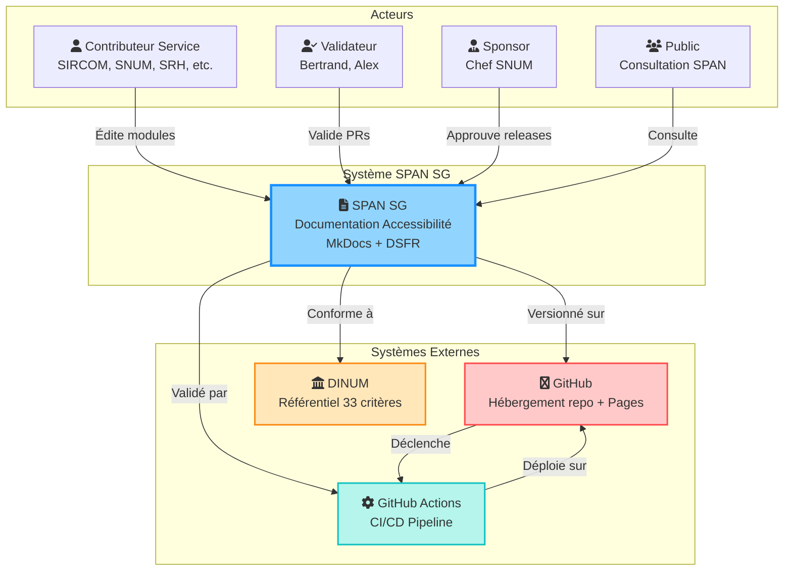
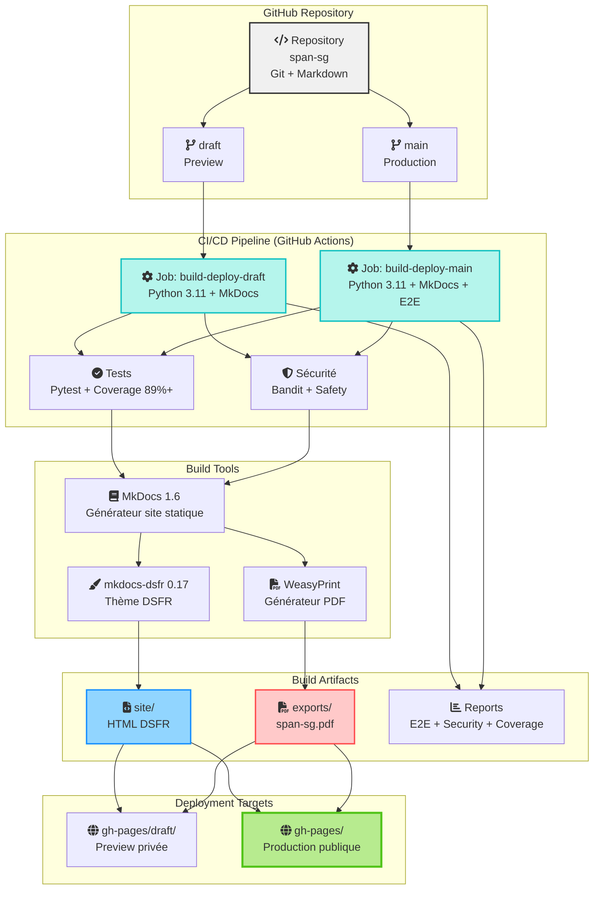
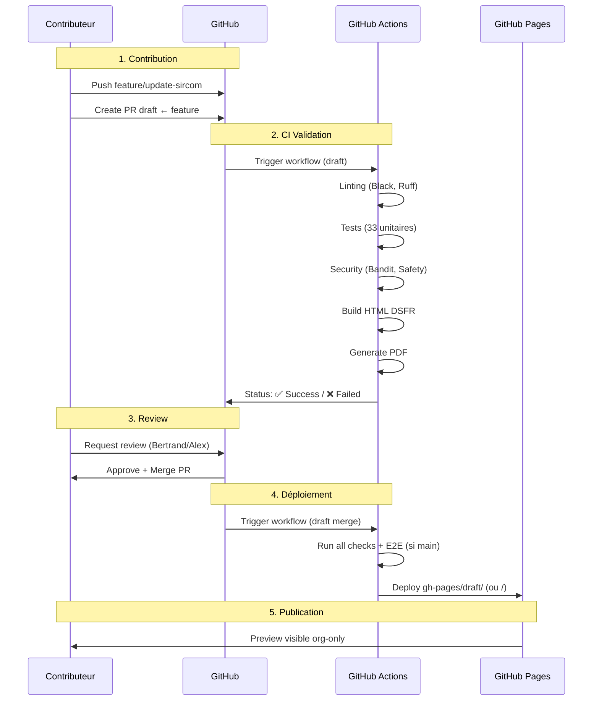
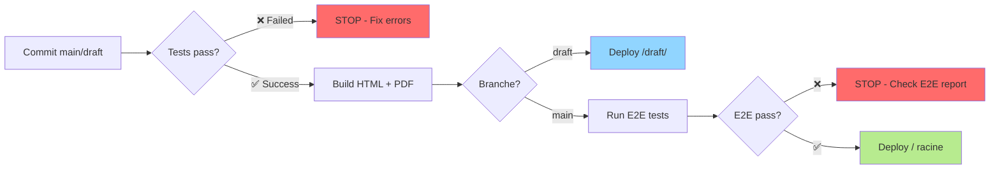

# Architecture C4 - Diagrammes Contexte et Containers

Représentations architecture C4 (Context, Containers, Components, Code) du projet SPAN SG.

Version: 1.0.1-dsfr
Dernière mise à jour: 2025-10-22
Standard: [C4 Model](https://c4model.com/)

---

## Introduction C4

Le modèle C4 décompose l'architecture en 4 niveaux de zoom :

1. **Context** : Vue système dans son écosystème (personnes, systèmes externes)
2. **Containers** : Applications, services, bases de données
3. **Components** : Modules logiques internes
4. **Code** : Classes, fonctions (optionnel)

Ce document couvre les niveaux 1-2.

---

## 1. C4 Level 1 : Diagramme de Contexte

Vue macro du système SPAN SG et ses acteurs.



**Acteurs principaux :**
- Contributeurs services (6 modules : SIRCOM, SNUM, SRH, SIEP, SAFI, BGS)
- Validateurs (review PRs, merge)
- Sponsor (validation conceptuelle, releases officielles)
- Public (consultation SPAN publié)

**Systèmes externes :**
- GitHub : Hébergement repo + Pages
- GitHub Actions : CI/CD automatisé
- DINUM : Référentiel 33 critères accessibilité

---

## 2. C4 Level 2 : Diagramme Containers

Détail des composants applicatifs du système SPAN SG.



**Containers identifiés :**

1. **Repository Git** :
   - Markdown sources (docs/modules/*.md)
   - Configurations (mkdocs-dsfr.yml, mkdocs-dsfr-pdf.yml)
   - Scripts Python (calculate_scores.py, enrich_pdf_metadata.py)
   - Hooks MkDocs (dsfr_table_wrapper.py, title_cleaner.py)

2. **CI/CD Pipeline** :
   - Job draft : Build + déploiement preview
   - Job main : Build + E2E + sécurité + déploiement production
   - Tests : Pytest (33 tests unitaires, 9 scénarios E2E)
   - Sécurité : Bandit (code security) + Safety (CVE dependencies)

3. **Build Artifacts** :
   - site/ : HTML DSFR (thème gouvernemental)
   - exports/span-sg.pdf : PDF avec métadonnées enrichies
   - Reports : E2E HTML, Security JSON, Coverage HTML

4. **Deployment Targets** :
   - gh-pages/draft/ : Preview privée (org-only)
   - gh-pages/ racine : Production publique

5. **Build Tools** :
   - MkDocs 1.6 : Générateur site statique
   - mkdocs-dsfr 0.17 : Thème DSFR officiel
   - WeasyPrint : Générateur PDF (CSS Paged Media)

---

## 3. Technologies et Dépendances

### Stack technique

| Layer | Technologie | Version | Rôle |
|-------|-------------|---------|------|
| Source | Markdown + YAML | - | Format documentation |
| Build | MkDocs | 1.6+ | Générateur site statique |
| Theme | mkdocs-dsfr | 0.17.0 | Design System État |
| PDF | WeasyPrint | 62.3 | Générateur PDF |
| Tests | Pytest | 8.3.4 | Tests unitaires + E2E |
| CI/CD | GitHub Actions | - | Pipeline automatisé |
| Hosting | GitHub Pages | - | Hébergement statique |

### Dépendances critiques

```python
# requirements-dsfr.txt
mkdocs==1.6.1
mkdocs-dsfr==0.17.0
mkdocs-git-revision-date-localized-plugin==1.3.0
pymdown-extensions==10.12
mkdocs-pdf-export-plugin==0.5.10
weasyprint==62.3
```

---

## 4. Flux de Données

Parcours typique d'une modification SPAN :



---

## 5. Stratégie de Déploiement

### Environnements

| Environnement | Branche | URL | Accès | Déploiement |
|---------------|---------|-----|-------|-------------|
| Preview | draft | /draft/ | Org-only | Auto (push draft) |
| Production | main | / racine | Public | Auto (push main) |

### Workflow déploiement



---

## 6. Sécurité et Qualité

### Gates qualité CI/CD

Chaque build passe par 7 gates obligatoires :

1. **Black formatter** : Formatage code uniforme
2. **Ruff linter** : Détection bugs, style, complexité
3. **Bandit** : Analyse sécurité code (HIGH/CRITICAL)
4. **Safety** : Scan CVE dependencies
5. **Pytest** : 33 tests unitaires (0 failed)
6. **Coverage** : Seuil 89%+ scripts, 100% hooks
7. **E2E** (main only) : 9 scénarios bout-en-bout

### Artefacts sécurité

Conservés en GitHub Actions Artifacts :

- **security-reports** : Bandit JSON + Safety JSON (90 jours)
- **e2e-report** : Rapport HTML scénarios (30 jours)
- **accessibility-report** : Tests RGAA Selenium (30 jours)
- **exports** : PDF SPAN (persistant)

---

## Références

- [C4 Model Official](https://c4model.com/)
- [Diagrammes Mermaid (6 existants)](diagrams.md)
- [ADR Architecture Decision Records](../adr/README.md)
- [API Reference Scripts](../dev/api-reference.md)
