# Architecture - Diagrammes

Représentations visuelles de l'architecture SPAN SG.

Version: 1.0.1-dsfr
Dernière mise à jour: 2025-10-11

---

## 1. CI/CD Pipeline

Pipeline complet GitHub Actions (draft + main).


**Validations:** Black, Ruff, pytest, coverage 89%+, DSFR, PDF, E2E (main seulement)

**Déploiement:**
- draft → `gh-pages/draft/`
- main → `gh-pages/` (racine)

---

## 2. Architecture Composants

Structure projet et dépendances.

```mermaid
graph TB
    subgraph "📁 docs/"
        A[modules/<br/>6 fichiers .md]
        B[synthese.md<br/>Tableau HTML DSFR]
        C[dev/<br/>API + Hooks Guide]
        D[adr/<br/>5 ADR]
        E[architecture/<br/>Diagrams]
    end

    subgraph "⚙️ scripts/"
        F[calculate_scores.py<br/>100% coverage]
        G[enrich_pdf_metadata.py<br/>78% coverage]
    end

    subgraph "🔧 hooks/"
        H[dsfr_table_wrapper.py<br/>100% coverage]
        I[title_cleaner.py<br/>100% coverage]
        J[pdf_copy.py<br/>0% coverage]
    end

    subgraph "✅ tests/"
        K[test_hooks*.py<br/>13 tests]
        L[test_calculate_scores*.py<br/>26 tests]
        M[test_enrich_pdf*.py<br/>7 tests]
        N[e2e/<br/>9 scénarios]
    end

    subgraph "🏗️ Build"
        O[mkdocs-dsfr.yml<br/>HTML DSFR]
        P[mkdocs-dsfr-pdf.yml<br/>PDF ReadTheDocs]
    end

    subgraph "📦 Output"
        Q[site/<br/>HTML DSFR]
        R[pdf-temp/<br/>PDF temp]
        S[exports/<br/>span-sg.pdf]
    end

    A --> F
    F --> B
    B --> O

    O --> H
    O --> I
    O --> Q

    P --> R
    R --> G
    G --> S

    K --> H
    K --> I
    L --> F
    M --> G

    style Q fill:#91d5ff
    style S fill:#ffc9c9
```



**Coverage global: 92%** (seuil 89%+)

---

## 3. Workflow Git Branches

Stratégie branching et releases.


**Branches:**
- `main`: Production (GitHub Pages racine)
- `draft`: Preview (GitHub Pages /draft/)

**Tags:** Releases officielles (v0.9.0, v1.0.0, v1.1.0, ...)

---

## 4. Architecture Hooks DSFR

Cycle de vie hooks MkDocs.


**Hooks:**
1. `on_page_content`: Traite body HTML
2. `on_post_page`: Traite HTML complet

---

## 5. Coverage Tests par Module

Distribution coverage actuelle.


**Légende:**
- ✅ Vert: 100% coverage (critiques)
- 🟡 Jaune: 78% coverage (acceptable)
- 🔴 Rouge: 0% coverage (v1.1)

**Total:** 138 statements, 11 miss, **92.03% coverage**

---

## 6. Déploiement GitHub Pages

Flow déploiement dual (draft + production).

```mermaid
flowchart LR
    subgraph "🔧 CI Build"
        A[mkdocs build<br/>DSFR]
        B[Validate HTML<br/>data-fr-scheme]
        C[Generate PDF<br/>--site-dir pdf-temp]
    end

    subgraph "🌿 Branches"
        D{Branche source?}
        E[draft]
        F[main]
    end

    subgraph "📦 gh-pages Branch"
        G[/draft/<br/>Preview]
        H[/ Racine<br/>Production]
    end

    subgraph "🌐 GitHub Pages"
        I[alexmacapple.github.io/<br/>span-sg-repo/draft/]
        J[alexmacapple.github.io/<br/>span-sg-repo/]
    end

    A --> B
    B --> C
    C --> D

    D -->|draft push| E
    D -->|main push| F

    E --> G
    F --> H

    G --> I
    H --> J

    style I fill:#91d5ff
    style J fill:#51cf66
```

**URLs:**
- Draft: https://alexmacapple.github.io/span-sg-repo/draft/
- Production: https://alexmacapple.github.io/span-sg-repo/

**Stratégie:** Git push direct (pas actions/deploy-pages, contrôle total)

---

## Notes techniques

### Diagrammes Mermaid

Les diagrammes sont renderisés automatiquement par MkDocs avec plugin `pymdownx.superfences`:

```yaml
# mkdocs-dsfr.yml
markdown_extensions:
  - pymdownx.superfences:
      custom_fences:
        - name: mermaid
          class: mermaid
          format: !!python/name:pymdownx.superfences.fence_code_format
```

### Modification diagrammes

1. Éditer ce fichier `docs/architecture/diagrams.md`
2. Build local : `mkdocs serve --config-file mkdocs-dsfr.yml`
3. Vérifier render : http://localhost:8000/architecture/diagrams/
4. Commit si OK

### Syntaxe Mermaid

- **Flowchart**: `graph TB` (Top-Bottom) / `graph LR` (Left-Right)
- **Sequence**: `sequenceDiagram`
- **Pie chart**: `pie title "..."`
- **Git graph**: `gitGraph`

Documentation: https://mermaid.js.org/

---

## Références

- [Mermaid Documentation](https://mermaid.js.org/)
- [MkDocs Material - Diagrams](https://squidfunk.github.io/mkdocs-material/reference/diagrams/)
- Architecture Decision Records: [docs/adr/](../adr/README.md)
- API Reference: [docs/dev/api-reference.md](../dev/api-reference.md)
