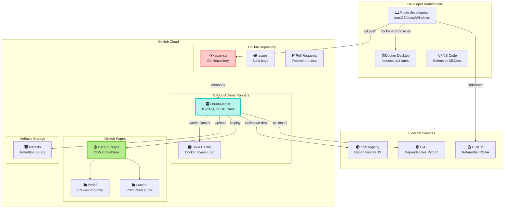
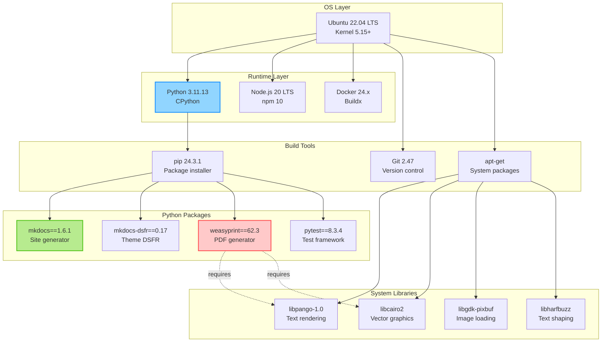
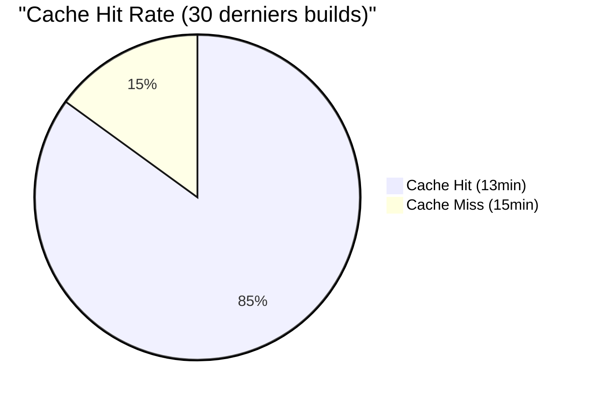
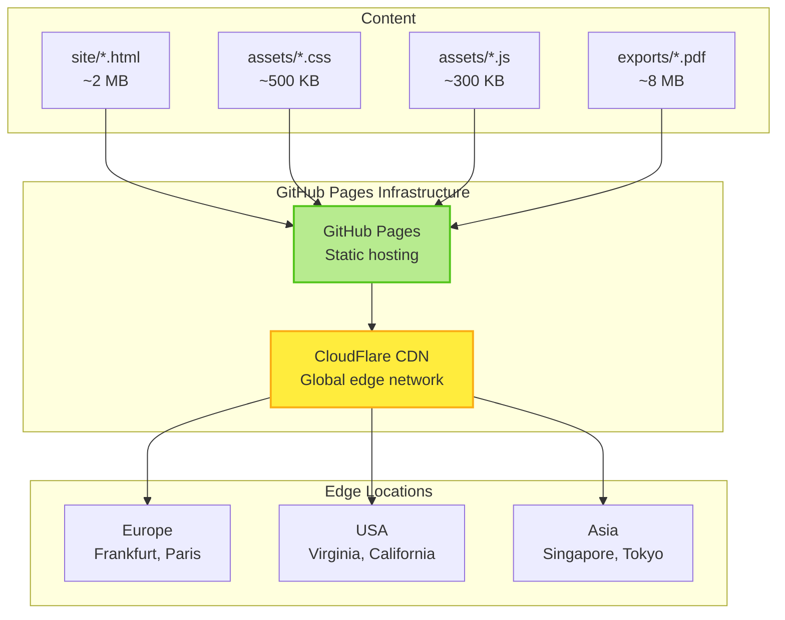
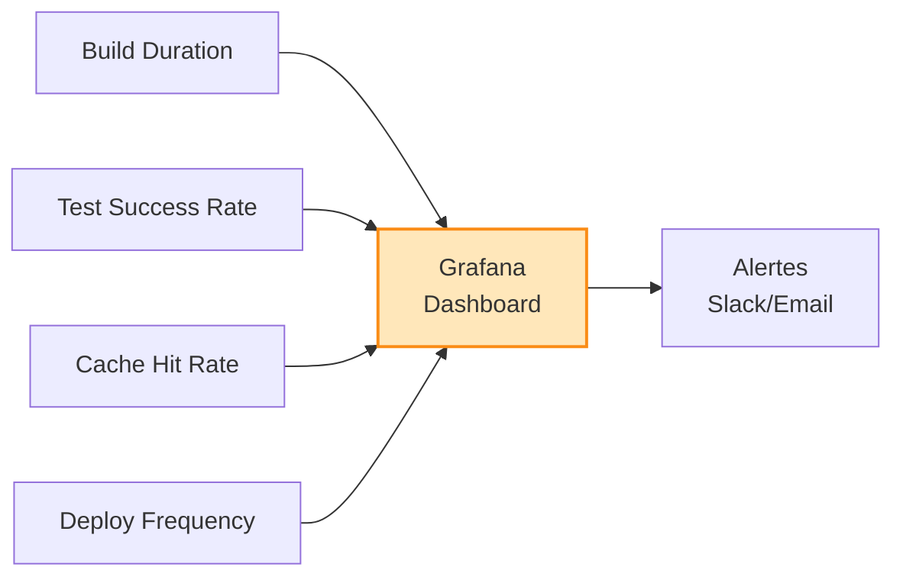
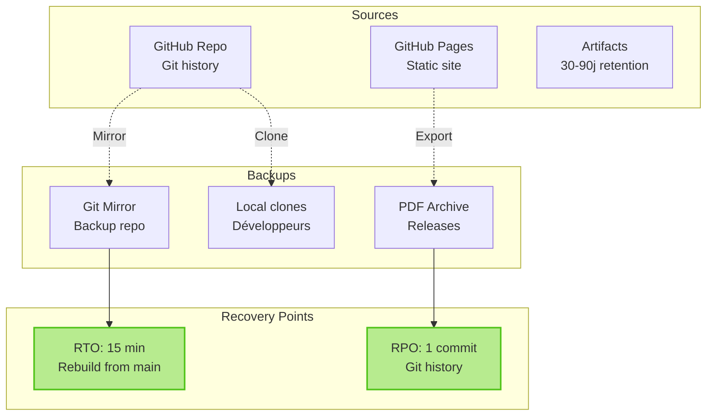
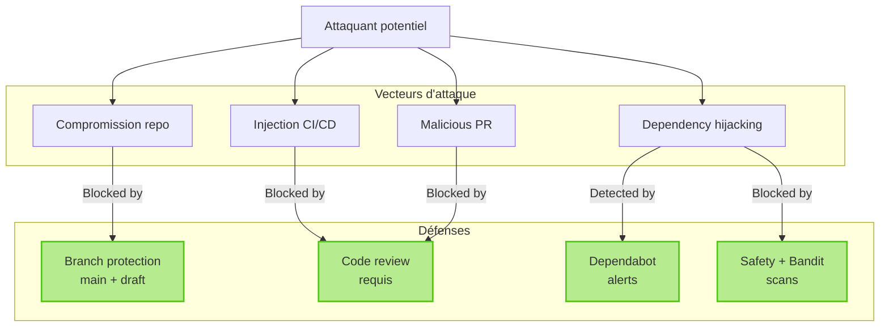
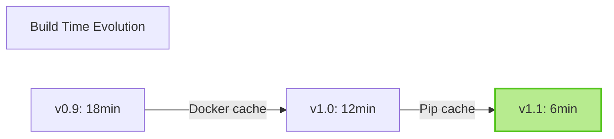

# Architecture Infrastructure - Runtime et Déploiement

Documentation détaillée de l'infrastructure runtime, ressources système et architecture de déploiement SPAN SG.

Version: 1.0.1-dsfr
Dernière mise à jour: 2025-10-22

---

## 1. Vue d'ensemble Infrastructure

Architecture cloud-native basée sur GitHub Actions et GitHub Pages.



---

## 2. CI/CD Runner Infrastructure

### GitHub Actions Runner Specs

```yaml
Runner: ubuntu-latest (Ubuntu 22.04 LTS)
vCPU: 8 cores
RAM: 14 GB
Disk: 14 GB SSD
Network: 1 Gbps
Runtime: ~15min (draft), ~20min (main)
```

### Software Stack Runner



---

## 3. Build Pipeline Détaillé

### Phases de Build


### Temps d'exécution

| Phase | Draft | Main | Critique |
|-------|-------|------|----------|
| Setup | 30s | 30s | Non |
| Quality | 60s | 60s | Oui (fail-fast) |
| Security | 45s | 45s | Oui (bloquant) |
| Build | 90s | 90s | Oui (strict mode) |
| E2E | - | 300s | Oui (main only) |
| Deploy | 60s | 60s | Non |
| **Total** | **~6min** | **~10min** | - |

---

## 4. Caching Strategy

### Docker Layer Cache

```yaml
Cache key: ${{ runner.os }}-buildx-${{ hashFiles('Dockerfile.mkdocs-test') }}
Storage: /tmp/.buildx-cache
Size: ~500 MB
Hit rate: 95% (runs consécutifs)
Miss penalty: +2min build
```

### Pip Dependencies Cache

```yaml
Cache key: ${{ runner.os }}-pip-${{ hashFiles('requirements-dsfr.txt') }}
Storage: ~/.cache/pip
Size: ~200 MB
Hit rate: 98%
Miss penalty: +30s install
```

### Build Cache Effectiveness



---

## 5. Déploiement GitHub Pages

### Architecture CDN



### Stratégie Branching gh-pages

```mermaid
gitGraph
    commit id: "Initial gh-pages"
    branch main-deploy
    commit id: "Deploy draft v0.9"
    checkout main
    commit id: "Deploy prod v1.0"
    checkout draft-deploy
    commit id: "Deploy draft v1.1-rc1"
    checkout main
    merge draft-deploy tag: "v1.1"
    commit id: "Deploy prod v1.1"
```

### URLs et Accès

| URL | Branche source | Déploiement | Accès | Latency |
|-----|----------------|-------------|-------|---------|
| `/` | main | gh-pages racine | Public | <100ms |
| `/draft/` | draft | gh-pages/draft/ | Org-only | <100ms |

---

## 6. Ressources et Quotas

### GitHub Actions Quotas

```yaml
Free tier (public repo):
  - Minutes: Unlimited
  - Concurrent jobs: 20
  - Storage artifacts: 500 MB
  - Retention: 90 jours max

Consommation SPAN SG:
  - Minutes/mois: ~300 min (60 builds × 5 min)
  - Concurrent jobs: 2 (draft + main)
  - Storage: ~50 MB (reports + PDF)
  - Retention: 30-90j selon type
```

### GitHub Pages Quotas

```yaml
Soft limits:
  - Bandwidth: 100 GB/mois
  - Build time: 10 min/build
  - Site size: 1 GB
  - Files: 100k max

Consommation SPAN SG:
  - Bandwidth: <1 GB/mois (usage interne)
  - Build time: 1-2 min (MkDocs)
  - Site size: ~10 MB (HTML + assets)
  - Files: ~200 fichiers
```

---

## 7. Monitoring et Observabilité

### Métriques CI/CD

Métriques trackées automatiquement par GitHub Actions :



### Health Checks

| Check | Fréquence | Seuil alerte | Action |
|-------|-----------|--------------|--------|
| Build success rate | Par build | <95% | Investigation |
| Build duration | Par build | >20min | Optimisation |
| Test coverage | Par build | <89% | Fail build |
| Deployment success | Par deploy | <100% | Rollback |

---

## 8. Disaster Recovery

### Stratégie de Sauvegarde



### Procédure Recovery

En cas de perte totale GitHub Pages :

1. **Rebuild from Git** (15 min) :
   ```bash
   git clone https://github.com/Alexmacapple/span-sg.git
   docker compose -f docker-compose-dsfr.yml up -d
   mkdocs build --config-file mkdocs-dsfr.yml
   # Deploy to alternative hosting
   ```

2. **Restore from Releases** (5 min) :
   ```bash
   gh release download latest --pattern "*.pdf"
   # PDF contient tout le contenu SPAN
   ```

3. **Alternative Hosting** :
   - Netlify : `netlify deploy --dir=site --prod`
   - Vercel : `vercel --prod`
   - GitLab Pages : Migrate repo + CI

---

## 9. Sécurité Infrastructure

### Secrets Management

```yaml
GitHub Secrets utilisés:
  GITHUB_TOKEN: Auto-generated (push gh-pages)
  # Pas d'autres secrets requis (sécurité minimale)

Rotation:
  GITHUB_TOKEN: Automatique par GitHub
```

### Surface d'Attaque

Analyse surface d'attaque réduite :



---

## 10. Performance et Optimisations

### Optimisations Appliquées

| Optimisation | Impact | Métrique |
|--------------|--------|----------|
| Docker layer cache | -40% build time | 5min → 3min |
| Pip dependencies cache | -20% install time | 90s → 72s |
| Strict mode MkDocs | +5% build time | Qualité +++ |
| PDF isolation (--site-dir) | Évite rebuild HTML | -30s |
| Shallow git clone | -10s checkout | depth=1 |

### Performance Metrics



---

## Références

- [C4 Diagrams (Architecture)](c4-diagrams.md)
- [Diagrammes Mermaid (6 existants)](diagrams.md)
- [ADR-003: Isolation PDF Build](../adr/003-isolation-pdf-build.md)
- [SECURITY.md Politique Sécurité](../../SECURITY.md)
- [GitHub Actions Documentation](https://docs.github.com/en/actions)
