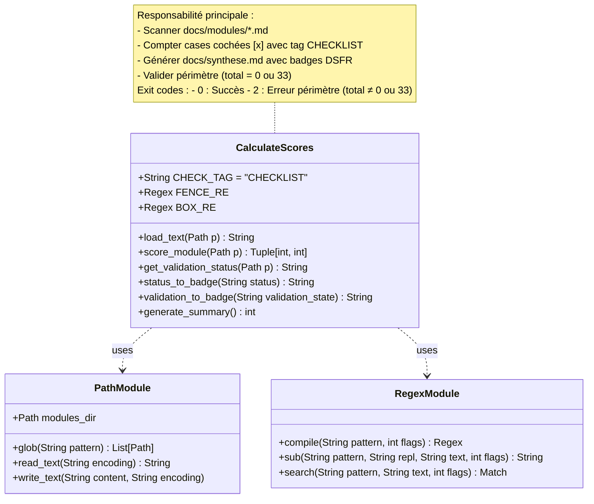
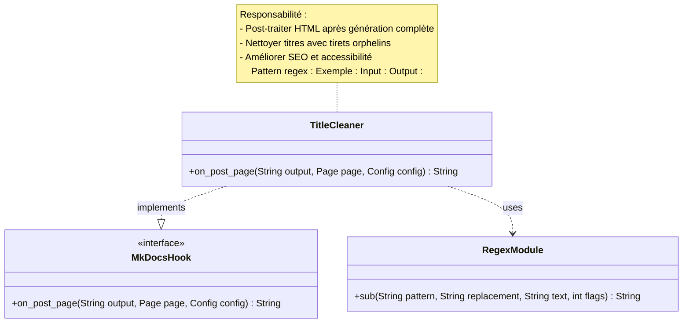
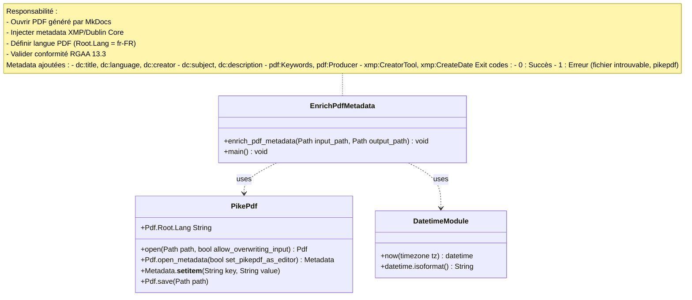
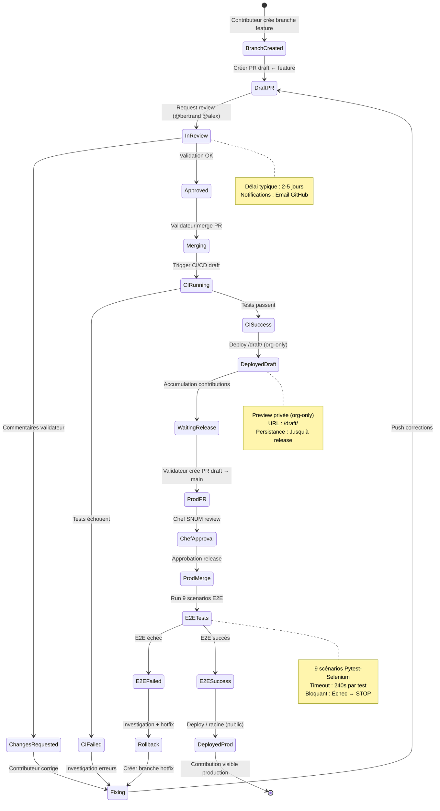
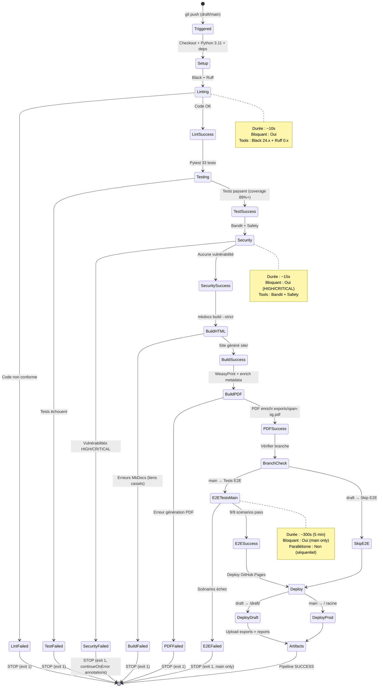
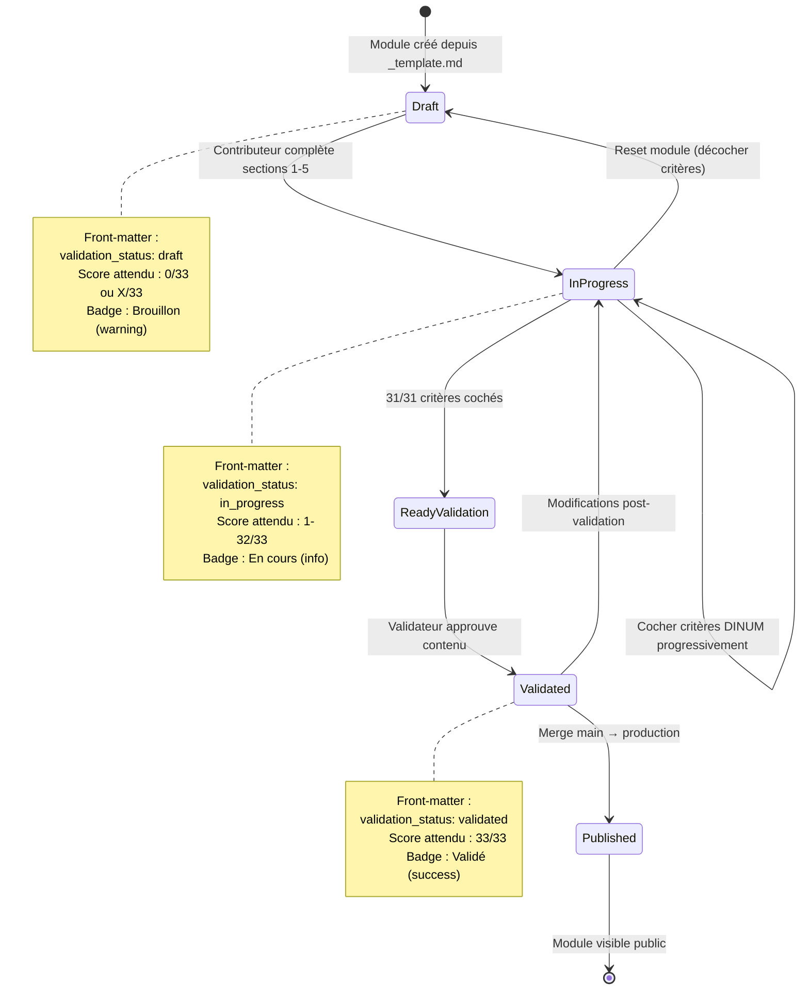
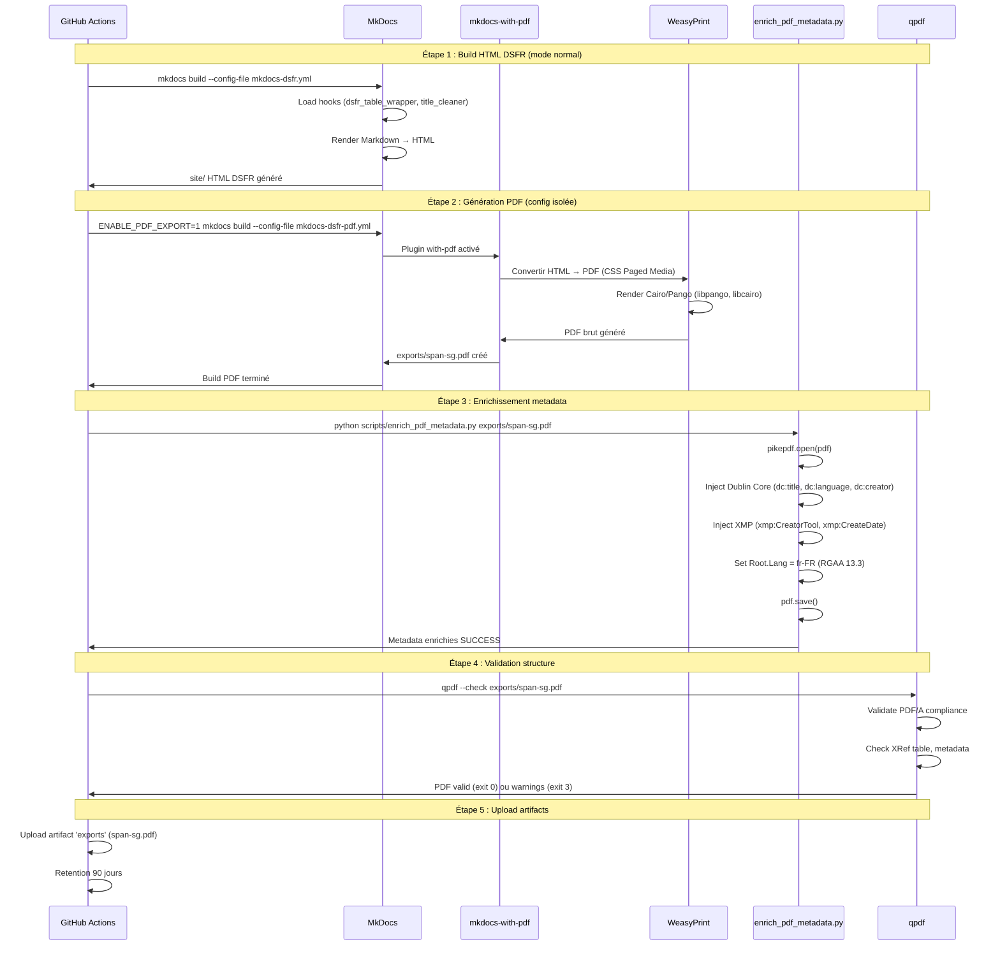
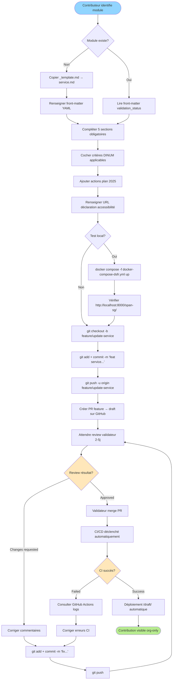
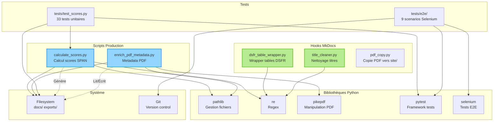

# Architecture UML - Diagrammes Classes et États

Diagrammes UML (Unified Modeling Language) pour les composants Python et workflows du projet SPAN SG.

Version: 1.0.1-dsfr
Dernière mise à jour: 2025-10-22
Standard: [UML 2.5](https://www.omg.org/spec/UML/)

---

## Introduction UML

Ce document présente deux types de diagrammes UML :

1. **Diagrammes de Classes** : Structure statique des scripts et hooks Python
2. **Diagrammes d'États** : Transitions dynamiques des workflows (PR, CI/CD, modules)

---

## 1. Diagrammes de Classes

### 1.1 Module calculate_scores.py

Script principal de calcul des scores SPAN (33 critères DINUM).



**Fonctions principales** :

| Fonction | Signature | Description |
|----------|-----------|-------------|
| `load_text()` | `Path → String` | Charge fichier et supprime code fences (```) |
| `score_module()` | `Path → (int, int)` | Compte checked/total avec tag CHECKLIST |
| `get_validation_status()` | `Path → String` | Extrait validation_status du front-matter YAML |
| `status_to_badge()` | `String → String` | Convertit statut en badge DSFR HTML |
| `validation_to_badge()` | `String → String` | Convertit état validation en badge DSFR |
| `generate_summary()` | `() → int` | Génère synthese.md avec tableau DSFR |

---

### 1.2 Hook dsfr_table_wrapper.py

Hook MkDocs pour wrapper les tableaux avec `<div class="fr-table">`.

```mermaid
classDiagram
    class DsfrTableWrapper {
        +on_page_content(String html, Page page, Config config, Files files) String
        -wrap_table(Match match) String
    }

    class MkDocsHook {
        <<interface>>
        +on_page_content(String html, Page page, Config config, Files files) String
    }

    class RegexModule {
        +sub(String pattern, Function repl, String text, int flags) String
    }

    DsfrTableWrapper ..|> MkDocsHook : implements
    DsfrTableWrapper ..> RegexModule : uses

    note for DsfrTableWrapper "Responsabilité :
    - Post-traiter HTML après Markdown → HTML
    - Détecter tables non wrappées
    - Injecter div.fr-table pour RGAA/DSFR

    Pattern regex :
    (?<!<div class=\"fr-table\">)\s*(<table[^>]*>.*?</table>)

    Évite re-wrapping avec lookahead négatif"
```

**Contexte technique** :

Le thème `mkdocs-dsfr` supprime les divs HTML lors du preprocessing Markdown. Ce hook réinjecte le wrapper DSFR après conversion HTML pour garantir l'accessibilité RGAA et le responsive design.

---

### 1.3 Hook title_cleaner.py

Hook MkDocs pour nettoyer les titres HTML redondants.



**Cas d'usage** :

Lorsque `site_name` est vide dans `mkdocs-dsfr.yml`, MkDocs génère des titres avec tirets superflus. Ce hook nettoie ces artefacts pour un meilleur référencement et conformité accessibilité.

---

### 1.4 Script enrich_pdf_metadata.py

Script d'enrichissement des métadonnées PDF (XMP, Dublin Core).



**Métadonnées Dublin Core injectées** :

| Clé | Valeur | Conformité |
|-----|--------|------------|
| `dc:title` | SPAN SG | RGAA 13.3 |
| `dc:language` | fr-FR | RGAA 13.3 (test_pdf_metadata_language) |
| `dc:creator` | Secrétariat Général | Metadata standard |
| `dc:subject` | Schéma Pluriannuel Accessibilité | SEO PDF |
| `pdf:Keywords` | SPAN, accessibilité, RGAA, DINUM | Recherche PDF |

---

## 2. Diagrammes d'États

### 2.1 États PR (Pull Request Workflow)

Cycle de vie d'une contribution depuis création jusqu'au déploiement.



**États clés** :

1. **DraftPR** : PR créée vers branche `draft` (base review)
2. **InReview** : Validateur notifié, review en cours (2-5j)
3. **ChangesRequested** : Corrections demandées (loop possible)
4. **CIRunning** : Pipeline CI/CD (linting, tests, security, build)
5. **DeployedDraft** : Preview déployée `/draft/` (org-only)
6. **WaitingRelease** : Contributions accumulées (30-60j)
7. **E2ETests** : Tests bout-en-bout (main only, bloquant)
8. **DeployedProd** : Production publique `/` (final)

---

### 2.2 États CI/CD Pipeline

États du pipeline GitHub Actions (draft et main).



**Phases critiques** :

| Phase | Durée | Fail-fast | Sortie |
|-------|-------|-----------|--------|
| Linting | 10s | Oui | exit 1 (non conforme) |
| Testing | 60s | Oui | exit 1 (tests KO, coverage <89%) |
| Security | 15s | Oui | exit 1 (vuln HIGH/CRITICAL) |
| Build HTML | 90s | Oui | exit 1 (strict mode, liens cassés) |
| Build PDF | 30s | Oui | exit 1 (WeasyPrint erreur) |
| E2E (main) | 300s | Oui | exit 1 (scénarios échec) |
| Deploy | 60s | Non | Rollback manuel si échec |

---

### 2.3 États Validation Module

États de validation d'un module SPAN (front-matter `validation_status`).



**Règles de transition** :

1. **Draft → InProgress** : Première coche `[x]` d'un critère DINUM
2. **InProgress → ReadyValidation** : 33/33 critères cochés (automatique)
3. **ReadyValidation → Validated** : Validation manuelle validateur (review contenu)
4. **Validated → Published** : Merge vers `main` (release production)
5. **Validated → InProgress** : Régression (décochage critère, corrections)

---

## 3. Diagramme Séquence : Génération PDF

Interaction entre composants pour générer le PDF SPAN.



**Étapes critiques** :

1. **Build HTML DSFR** : MkDocs avec thème DSFR (strict mode, hooks actifs)
2. **Génération PDF isolée** : Config séparée `mkdocs-dsfr-pdf.yml` (strict: false, theme readthedocs requis)
3. **Enrichissement metadata** : Injection XMP/Dublin Core avec `pikepdf` (conformité RGAA 13.3)
4. **Validation qpdf** : Vérification structure PDF (exit 3 = warnings non bloquants)
5. **Upload artifacts** : Persistance GitHub Actions (30-90j retention)

---

## 4. Diagramme Activité : Workflow Contributeur

Activités typiques d'un contributeur depuis identification du module jusqu'au déploiement.



**Durée totale estimée** : 30-60 jours (15 min édition + 2-5j review + 30-60j release production)

---

## 5. Diagramme Composants : Architecture Scripts

Organisation des scripts Python et leurs dépendances.



**Dépendances critiques** :

| Script | Dépendances | Utilisation |
|--------|-------------|-------------|
| `calculate_scores.py` | pathlib, re | Scan modules, regex critères, I/O fichiers |
| `enrich_pdf_metadata.py` | pikepdf, pathlib | Manipulation PDF, metadata XMP |
| `dsfr_table_wrapper.py` | re | Regex wrapper tables HTML |
| `title_cleaner.py` | re | Regex nettoyage titres |
| `tests/test_scores.py` | pytest, pathlib | Tests unitaires, fixtures |
| `tests/e2e/` | pytest, selenium, git | Tests E2E, navigation, état Git |

---

## Références

- [UML 2.5 Specification](https://www.omg.org/spec/UML/)
- [Mermaid Class Diagrams](https://mermaid.js.org/syntax/classDiagram.html)
- [Mermaid State Diagrams](https://mermaid.js.org/syntax/stateDiagram.html)
- [C4 Diagrams (Architecture)](c4-diagrams.md)
- [Infrastructure Runtime](infrastructure.md)
- [API Reference Scripts](../dev/api-reference.md)
