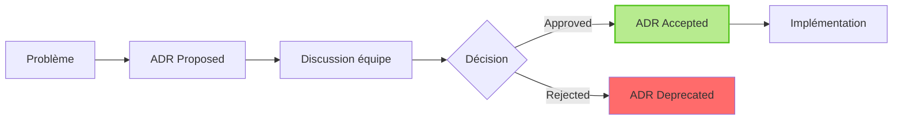
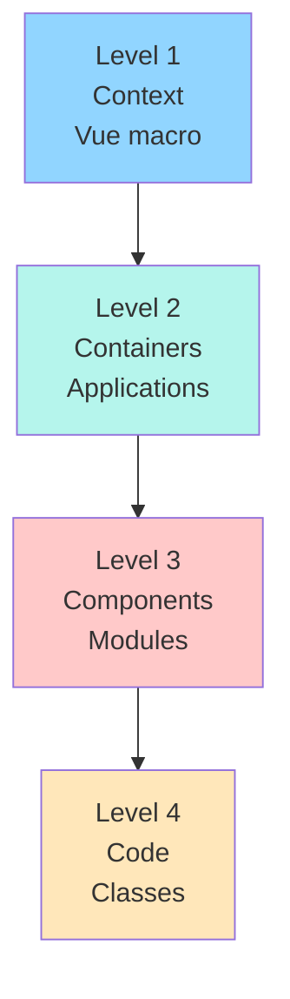
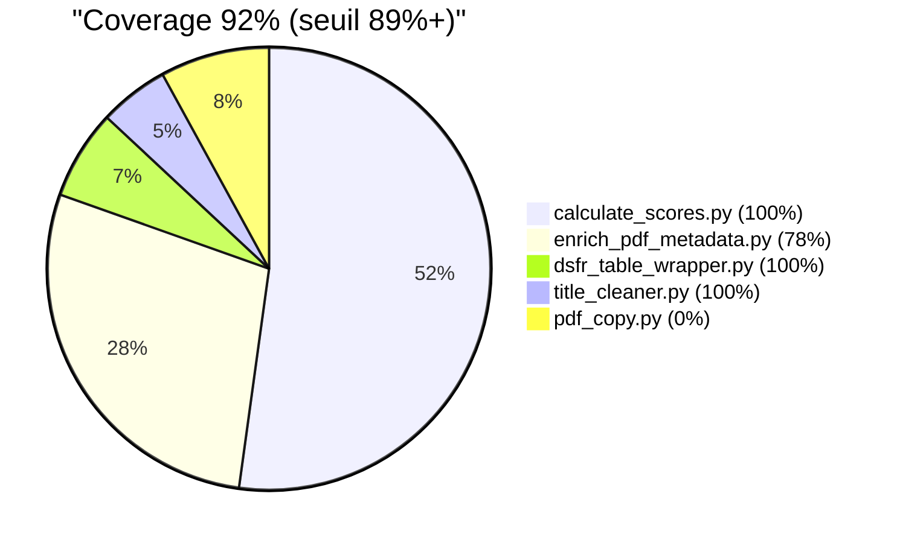
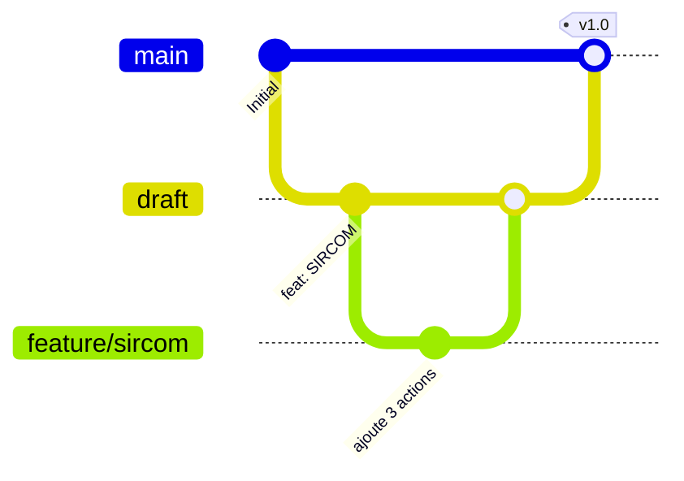
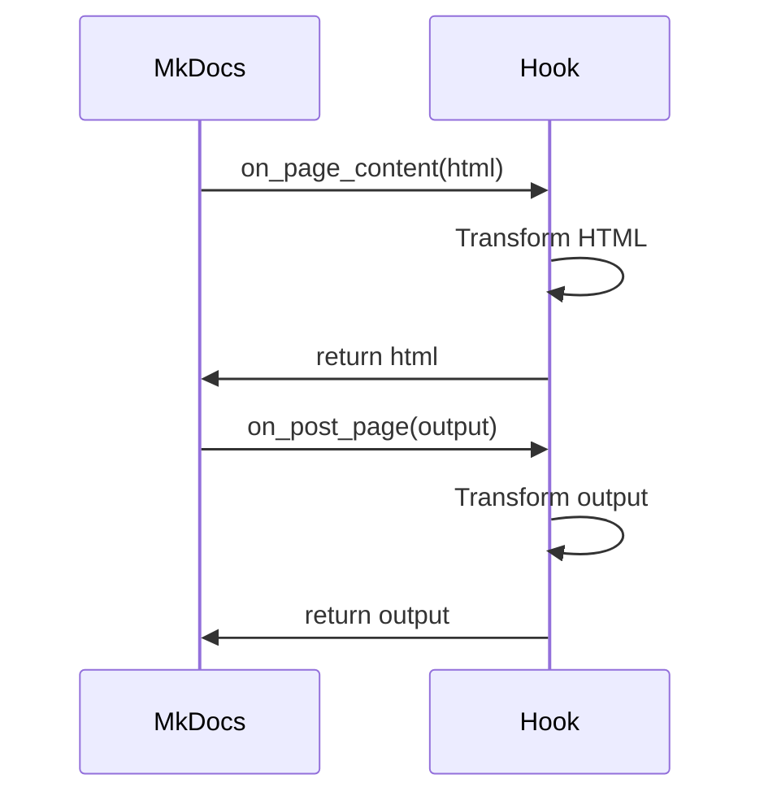
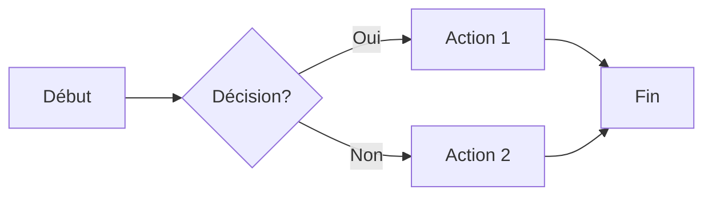
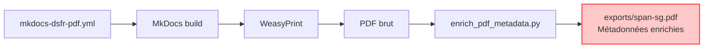

# Glossaire SPAN SG - Termes Techniques Illustrés

Définitions des termes techniques, acronymes et concepts du projet SPAN SG.

Version: 1.0.1-dsfr
Dernière mise à jour: 2025-10-22
Organisation alphabétique

---

## A

### Accessibilité Numérique

**Définition :** Capacité d'un service numérique à être utilisable par tous, y compris les personnes en situation de handicap (moteur, visuel, auditif, cognitif).

**Standard français :** RGAA 4.1 (Référentiel Général d'Amélioration de l'Accessibilité)

**Exemple pratique :**
```markdown
❌ Mauvais : 
✅ Bon : 
```

**Référence :** [ADR-007](adr/007-mkdocs-dsfr-language-divergence.md)

---

### ADR (Architecture Decision Record)

**Définition :** Document traçant une décision technique majeure (contexte, alternatives, conséquences).

**Format :** MADR (Markdown Any Decision Records)

**Exemple :**
```
ADR-001: Adoption thème DSFR vs Material
ADR-003: Isolation build PDF avec --site-dir
ADR-006: Migration 31 → 33 critères DINUM
```

**Diagramme :**


**Documentation :** [docs/adr/README.md](adr/README.md)

---

## C

### C4 Model

**Définition :** Modèle de documentation architecture logicielle en 4 niveaux de zoom.

**Niveaux :**
1. **Context** : Système dans son écosystème
2. **Containers** : Applications, services, BDD
3. **Components** : Modules logiques internes
4. **Code** : Classes, fonctions (optionnel)

**Diagramme :**


**Référence :** [docs/architecture/c4-diagrams.md](architecture/c4-diagrams.md)

---

### CI/CD (Continuous Integration / Continuous Deployment)

**Définition :** Pipeline automatisé de validation et déploiement du code.

**Pipeline SPAN SG :**


**Steps :**
1. Linting (Black, Ruff)
2. Tests (Pytest 33, Coverage 89%+)
3. Sécurité (Bandit, Safety)
4. Build (MkDocs DSFR + PDF)
5. Deploy (GitHub Pages)

**Durée :** 6 min (draft), 10 min (main)

**Référence :** [docs/architecture/diagrams.md](architecture/diagrams.md#1-cicd-pipeline)

---

### Coverage (Couverture de Tests)

**Définition :** Pourcentage de code exécuté par les tests automatisés.

**Seuils SPAN SG :**
- Scripts production : **89%+ requis**
- Hooks MkDocs : **100% requis**

**Exemple :**
```bash
pytest --cov=scripts --cov-fail-under=89
# PASSED: 92.03% coverage (seuil 89%)
```

**Distribution :**


**Référence :** [ADR-005](adr/005-coverage-89-percent.md)

---

## D

### DINUM (Direction Interministérielle du Numérique)

**Définition :** Direction gouvernementale pilotant la transformation numérique de l'État.

**Rôle SPAN SG :**
- Éditeur référentiel 33 critères accessibilité
- Contrôleur conformité SPAN administrations
- Référence : Checklist `SPAN-checklist-v2024-02-05-AAL.ots`

**Critères DINUM :**
```markdown
- [x] 1.1.1 Nommer un référent accessibilité <!-- DINUM -->
- [x] 1.1.2 Former le référent <!-- DINUM -->
- [ ] 1.1.3 Sensibiliser les équipes <!-- DINUM -->
...
(31 critères au total)
```

**Site officiel :** https://www.numerique.gouv.fr/

---

### Docker

**Définition :** Plateforme de containerisation pour empaqueter applications + dépendances.

**Usage SPAN SG :**
```bash
# Lancer MkDocs DSFR en local
docker compose -f docker-compose-dsfr.yml up
# → http://localhost:8000/span-sg/
```

**Image utilisée :**
```yaml
# docker-compose-dsfr.yml
services:
  mkdocs:
    image: python:3.11-slim
    volumes:
      - .:/docs
    ports:
      - 8000:8000
    command: mkdocs serve --config-file mkdocs-dsfr.yml
```

**Référence :** [HOWTO.md](../HOWTO.md#docker)

---

### DSFR (Design System de l'État Français)

**Définition :** Charte graphique officielle des sites gouvernementaux français.

**Composants :**
- Header Marianne officiel
- Couleurs État (bleu France #000091)
- Typographie Marianne
- Composants accessibles (boutons, cards, alerts)

**Exemple :**
```html
<!-- Bouton DSFR -->
<button class="fr-btn">Action principale</button>

<!-- Card DSFR -->
<div class="fr-card">
  <div class="fr-card__body">
    <h3 class="fr-card__title">Titre</h3>
    <p class="fr-card__desc">Description</p>
  </div>
</div>
```

**Version :** mkdocs-dsfr 0.17.0

**Référence :** [ADR-001](adr/001-choix-theme-dsfr.md)

---

## E

### E2E (End-to-End Tests)

**Définition :** Tests automatisés simulant parcours utilisateur complet.

**Scénarios SPAN SG (9) :**
1. Full Workflow (13 étapes)
2. Multi Modules (SIRCOM + SNUM + SRH)
3. Erreur Périmètre (détection 0/198 invalide)
4. Erreur Markdown (lien cassé)
5. Performance (build < 30s)
6. PDF Complet (métadonnées enrichies)
7. Rollback (0/198 → 6/198 → 0/198)
8. Preview HTTP (serveur local)
9. Front-matter (validation YAML)

**Résultats :**
```
=== Résumé E2E ===
✅ Passés   : 9
❌ Échoués  : 0
⏭️  Skippés : 0
```

**Référence :** [tests/e2e/](../tests/e2e/)

---

## G

### Git

**Définition :** Système de contrôle de versions décentralisé.

**Workflow SPAN SG :**


**Branches :**
- `main` : Production (gh-pages racine)
- `draft` : Preview (gh-pages /draft/)
- `feature/*` : Contributions services

**Référence :** [CONTRIBUTING.md](contributing.md#workflow-git)

---

### GitHub Actions

**Définition :** Service CI/CD intégré à GitHub.

**Runner specs :**
- OS : Ubuntu 22.04 LTS
- vCPU : 8 cores
- RAM : 14 GB
- Durée : 15-20 min/build

**Workflow :**
```yaml
# .github/workflows/build.yml
jobs:
  build-and-deploy-draft:
    runs-on: ubuntu-latest
    steps:
      - uses: actions/checkout@v3
      - name: Setup Python
        uses: actions/setup-python@v4
      ...
```

**Référence :** [docs/architecture/infrastructure.md](architecture/infrastructure.md)

---

### GitHub Pages

**Définition :** Hébergement gratuit de sites statiques par GitHub.

**URLs SPAN SG :**
- Production : https://alexmacapple.github.io/span-sg/
- Preview : https://alexmacapple.github.io/span-sg/draft/ (org-only)

**Branche :** `gh-pages`

**CDN :** CloudFlare (latence <100ms)

---

## H

### Hooks MkDocs

**Définition :** Scripts Python exécutés pendant le build MkDocs.

**Hooks SPAN SG :**
1. **dsfr_table_wrapper.py** : Encapsule `<table>` dans `<div class="fr-table">`
2. **title_cleaner.py** : Nettoie titres HTML (regex `SPAN - `)
3. **pdf_copy.py** : Copie PDF de pdf-temp/ vers exports/

**Lifecycle :**


**Référence :** [docs/dev/hooks-guide.md](dev/hooks-guide.md)

---

## M

### Markdown

**Définition :** Langage de balisage léger pour écrire documentation formatée.

**Syntaxe SPAN SG :**
```markdown
# Titre 1
## Titre 2

**Gras** *Italique*

- [ ] Case à cocher <!-- DINUM -->
- [x] Case cochée <!-- DINUM -->

[Lien](https://example.com)

| Colonne 1 | Colonne 2 |
|-----------|-----------|
| Valeur A  | Valeur B  |
```

**Extensions :**
- `pymdownx.superfences` : Blocs code + Mermaid
- `attr_list` : Attributs HTML
- `tables` : Tableaux

---

### Mermaid

**Définition :** Langage de diagrammes textuels (flowcharts, sequences, etc.).

**Types utilisés SPAN SG :**
- `graph TB` : Flowchart vertical
- `graph LR` : Flowchart horizontal
- `sequenceDiagram` : Diagramme de séquences
- `pie` : Diagramme camembert
- `gitGraph` : Historique Git
- `journey` : Parcours utilisateur

**Exemple :**


**Documentation :** https://mermaid.js.org/

---

### MkDocs

**Définition :** Générateur de site statique spécialisé documentation technique.

**Version :** 1.6.1

**Configuration SPAN SG :**
- Principale : `mkdocs-dsfr.yml` (HTML)
- PDF : `mkdocs-dsfr-pdf.yml` (PDF)

**Build :**
```bash
mkdocs build --config-file mkdocs-dsfr.yml --strict
# → site/ (HTML)

ENABLE_PDF_EXPORT=1 mkdocs build --config-file mkdocs-dsfr-pdf.yml
# → exports/span-sg.pdf
```

**Référence :** [dev-local.md](dev-local.md)

---

## P

### PDF (Portable Document Format)

**Définition :** Format de document portable cross-platform.

**Génération SPAN SG :**


**Métadonnées enrichies :**
```python
{
    "Title": "SPAN SG - Schéma Pluriannuel Accessibilité Numérique",
    "Author": "Secrétariat Général MEFSIN",
    "Subject": "Conformité RGAA 4.1",
    "Keywords": "SPAN, RGAA, accessibilité, DINUM",
    "Producer": "MkDocs + WeasyPrint",
}
```

**Référence :** [ADR-003](adr/003-isolation-pdf-build.md)

---

### Pytest

**Définition :** Framework de tests unitaires Python.

**Tests SPAN SG :**
- **33 tests unitaires** (scripts + hooks)
- **9 scénarios E2E**
- **Coverage 89%+** (seuil enforced)

**Exécution :**
```bash
pytest --cov=scripts --cov-fail-under=89
# 33 passed, 92.03% coverage
```

**Référence :** [docs/dev/api-reference.md](dev/api-reference.md)

---

## R

### RGAA (Référentiel Général d'Amélioration de l'Accessibilité)

**Définition :** Standard français d'accessibilité numérique (basé WCAG 2.1).

**Version :** RGAA 4.1 (2021)

**Structure :**
- 13 thématiques
- 106 critères
- 258 tests

**Niveaux conformité :**
- **A** : Basique
- **AA** : Intermédiaire (requis administrations)
- **AAA** : Avancé (optionnel)

**Site officiel :** https://accessibilite.numerique.gouv.fr/

---

## S

### SPAN (Schéma Pluriannuel d'Accessibilité Numérique)

**Définition :** Document obligatoire administrations publiques (>50 agents) planifiant mise en conformité accessibilité numérique sur 3 ans.

**Obligation légale :**
- Loi n° 2005-102 du 11/02/2005
- Décret n° 2019-768 du 24/07/2019

**Structure SPAN SG :**
- **1 SPAN global** (Secrétariat Général)
- **6 modules services** (SIRCOM, SNUM, SRH, SIEP, SAFI, BGS)
- **33 critères DINUM** (checklist officielle)
- **Synthèse HTML** (tableau agrégé)

**Format :**
```markdown
# SPAN [Service]

## 1. Périmètre
[Sites, applications, services numériques]

## 2. État des lieux
[Audit conformité, taux accessibilité]

## 3. Organisation
[Référent, équipes, budget]

## 4. Plan d'action
[Actions prioritaires 2025-2027]

## 5. Indicateurs
[KPI suivi, objectifs chiffrés]
```

**Référence :** [PRD-v3.3.md](../PRD-v3.3.md)

---

## W

### WeasyPrint

**Définition :** Bibliothèque Python de génération PDF depuis HTML/CSS.

**Version :** 62.3

**Dépendances système :**
```bash
libpango-1.0-0      # Text rendering
libcairo2           # Vector graphics
libgdk-pixbuf2.0-0  # Image loading
libharfbuzz-dev     # Text shaping
```

**Usage SPAN SG :**
```python
# mkdocs-pdf-export-plugin utilise WeasyPrint
weasyprint.HTML(
    string=html_content,
    base_url=base_url
).write_pdf(output_path)
```

**Référence :** [ADR-003](adr/003-isolation-pdf-build.md)

---

## Acronymes

| Acronyme | Signification | Contexte |
|----------|---------------|----------|
| ADR | Architecture Decision Record | Documentation décisions techniques |
| CI/CD | Continuous Integration/Deployment | Pipeline automatisé |
| DINUM | Direction Interministérielle du Numérique | Administration État |
| DSFR | Design System de l'État Français | Charte graphique gouvernementale |
| E2E | End-to-End | Tests bout-en-bout |
| PDF | Portable Document Format | Format document |
| RGAA | Référentiel Général Amélioration Accessibilité | Standard français |
| SPAN | Schéma Pluriannuel Accessibilité Numérique | Document obligatoire |
| WCAG | Web Content Accessibility Guidelines | Standard international W3C |

---

## Références

- [Documentation MkDocs](https://www.mkdocs.org/)
- [DSFR Documentation](https://www.systeme-de-design.gouv.fr/)
- [RGAA 4.1 Référentiel](https://accessibilite.numerique.gouv.fr/)
- [DINUM Site Officiel](https://www.numerique.gouv.fr/)
- [Mermaid Documentation](https://mermaid.js.org/)
- [ADR GitHub Organization](https://adr.github.io/)
