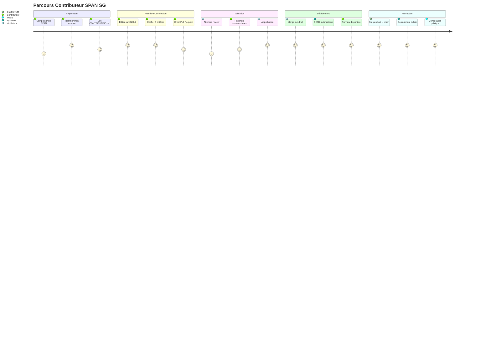
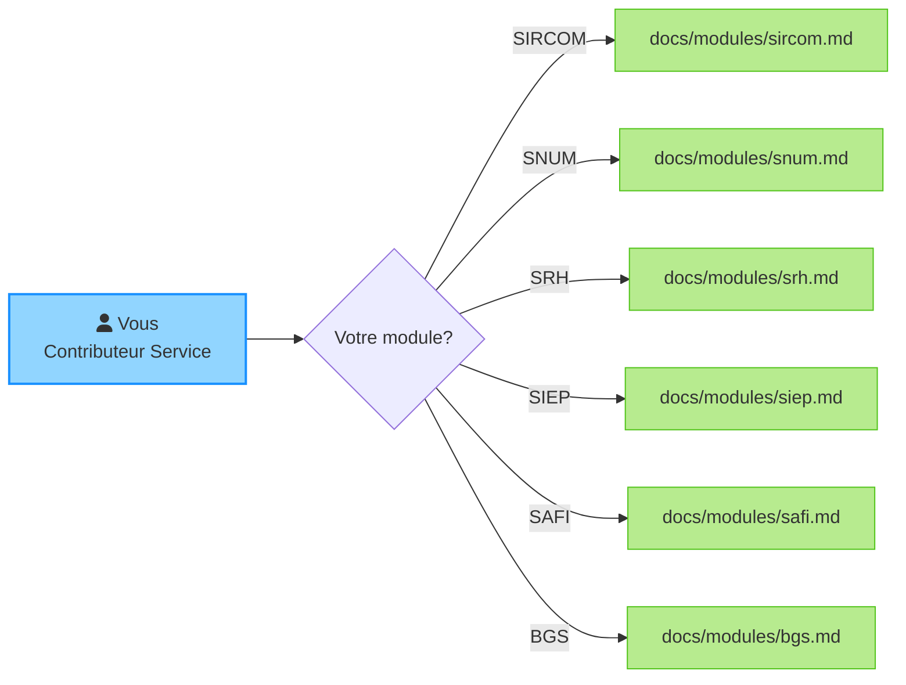
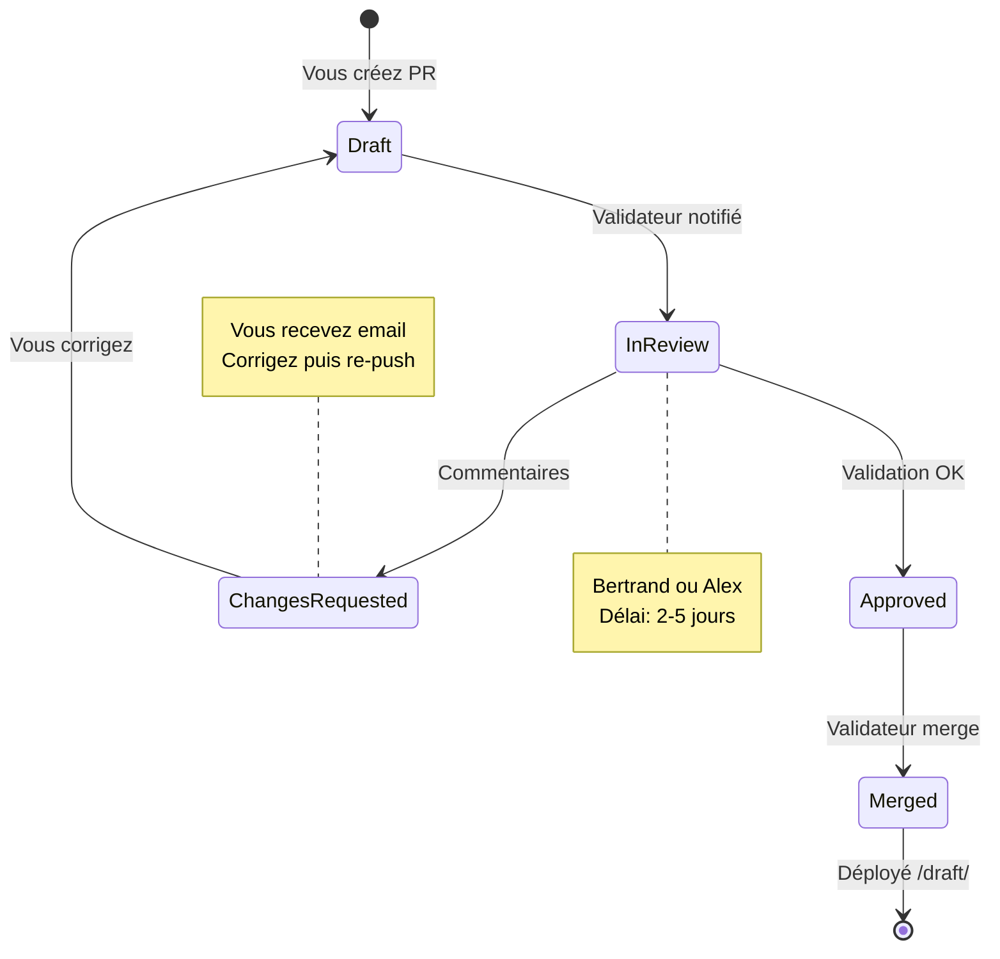
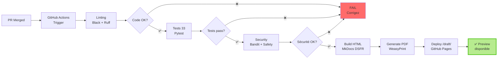
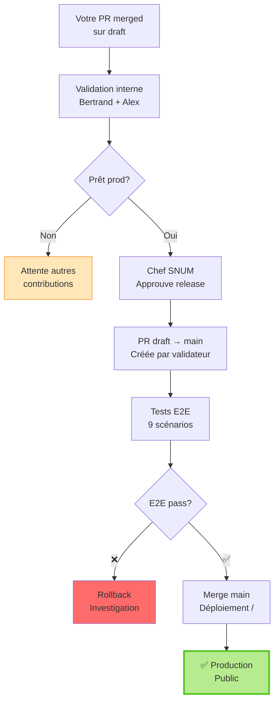
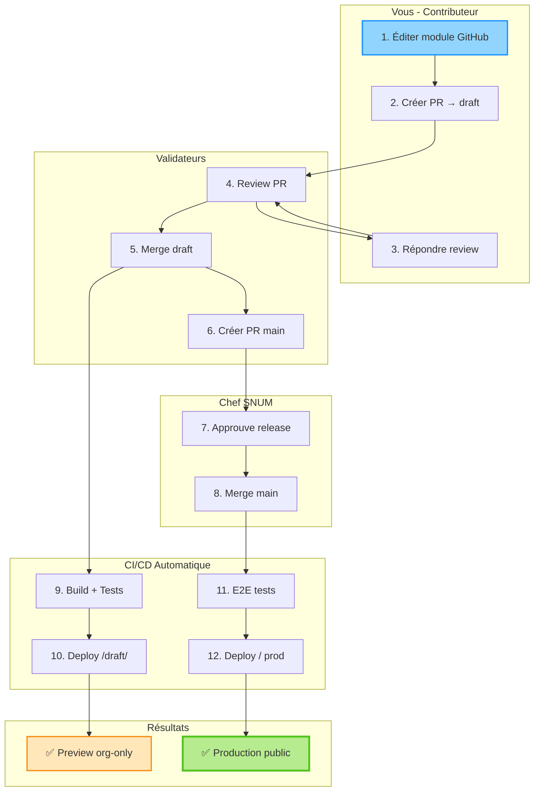

# Guide Onboarding Visuel - Contributeur SPAN SG

Guide visuel interactif pour démarrer la contribution au projet SPAN SG en 5 étapes.

Version: 1.0.1-dsfr
Dernière mise à jour: 2025-10-22
Public cible: Contributeurs services (débutants Git)

---

## Parcours Contributeur

Votre voyage de la première modification au déploiement production.



---

## Étape 1 : Préparation (10 minutes)

### 1.1 Comprendre votre rôle



### 1.2 Checklist préparation

- [ ] J'ai un compte GitHub
- [ ] Je connais mon service (SIRCOM, SNUM, etc.)
- [ ] J'ai lu le [CONTRIBUTING.md](contributing.md)
- [ ] Je sais qui contacter (Bertrand, Alex)

### 1.3 Ressources utiles

| Document | Description | Lien |
|----------|-------------|------|
| Template module | Structure 33 critères DINUM | [_template.md](modules/_template.md) |
| Checklist DINUM | 33 points officiels | [ADR-006](adr/006-migration-checklist-33-criteres.md) |
| Guide local | Développement Docker | [dev-local.md](dev-local.md) |

---

## Étape 2 : Première Modification (15 minutes)

### 2.1 Interface GitHub (recommandé)

Workflow simplifié sans installation Git.

```mermaid
flowchart TD
    A[Ouvrir GitHub<br/>span-sg/docs/modules/] --> B[Cliquer votre fichier<br/>Ex: sircom.md]
    B --> C[Cliquer icône ✏️<br/>Edit this file]
    C --> D{Que faire?}

    D -->|Cocher critères| E[Remplacer [ ] par [x]<br/>Lignes avec DINUM]
    D -->|Ajouter actions| F[Compléter tableau<br/>Plan d'actions 2025]
    D -->|URL déclaration| G[Section Déclaration<br/>Renseigner URL]

    E --> H[Scroll en bas]
    F --> H
    G --> H

    H --> I[Commit message<br/>Ex: feat sircom ajoute 3 actions]
    I --> J[Create new branch<br/>update-sircom-221022]
    J --> K[Propose changes]

    K --> L[Create Pull Request]
    L --> M{Base: draft?}
    M -->|✅ Oui| N[Create PR]
    M -->|❌ Non| O[Changer base → draft]
    O --> N

    style C fill:#91d5ff,stroke:#1890ff,stroke-width:2px
    style N fill:#b7eb8f,stroke:#52c41a,stroke-width:3px
```

### 2.2 Exemple modification

**Avant :**
```markdown
- [ ] 1.1.1 Nommer un référent accessibilité <!-- DINUM -->
```

**Après :**
```markdown
- [x] 1.1.1 Nommer un référent accessibilité <!-- DINUM -->
```

**ATTENTION :**
- ✅ Cocher/décocher `[x]` ou `[ ]`
- ✅ Modifier texte sections 1-5
- ❌ NE PAS supprimer `<!-- DINUM -->`
- ❌ NE PAS ajouter de nouvelles lignes DINUM

---

## Étape 3 : Review et Validation (2-5 jours)

### 3.1 Cycle de review



### 3.2 Notifications email

Vous recevrez automatiquement :

1. **PR créée** : Confirmation création
2. **Review comments** : Demandes de modifications
3. **Approved** : Validation par validateur
4. **Merged** : PR intégrée à draft
5. **CI/CD success** : Build et déploiement OK

### 3.3 Dashboard PR

Suivez l'état de votre PR sur GitHub :

```
https://github.com/Alexmacapple/span-sg/pulls
```

Filtres utiles :
- `is:pr author:@me` : Vos PRs
- `is:pr is:open` : PRs en attente
- `is:pr is:merged` : PRs intégrées

---

## Étape 4 : CI/CD Automatique (10 minutes)

### 4.1 Pipeline de validation

Après merge de votre PR, le pipeline CI/CD s'exécute automatiquement.



### 4.2 Monitoring build

Suivez le build en temps réel :

```
https://github.com/Alexmacapple/span-sg/actions
```

Statuts possibles :
- ⏳ **In progress** (jaune) : Build en cours (~6 min)
- ✅ **Success** (vert) : Déployé avec succès
- ❌ **Failed** (rouge) : Erreur (contactez validateur)

### 4.3 Logs utiles

En cas d'erreur, consultez :

1. **Calculate SPAN scores** : Erreur comptage critères
2. **Build site DSFR** : Erreur Markdown/YAML
3. **Validate PDF** : Erreur génération PDF

---

## Étape 5 : Déploiement Production (sur demande)

### 5.1 De draft à main

Votre contribution est maintenant sur `/draft/`. Pour passer en production :



### 5.2 Timeline typique

| Événement | Délai | Acteur |
|-----------|-------|--------|
| Contribution initiale | J+0 | Vous |
| Review PR | J+2-5 | Validateur |
| Merge draft | J+5 | Validateur |
| Accumulation contributions | J+5-30 | Équipe |
| Release v1.x | J+30-60 | Chef SNUM |
| Production publique | J+30-60 | Automatique |

---

## FAQ Contributeur

### Combien de temps prend une contribution ?

- ✏️ **Modification** : 15 minutes
- 🔍 **Review** : 2-5 jours
- 🚀 **Déploiement draft** : 10 minutes (automatique)
- 🌐 **Production** : 30-60 jours (groupé avec autres contributions)

### Puis-je voir ma contribution avant production ?

Non, la preview `/draft/` est désactivée (accès org-only). Options :

1. **Build local** : Suivre [dev-local.md](dev-local.md) (Docker)
2. **PDF** : Télécharger depuis Artifacts CI (nécessite compte GitHub)
3. **Attendre production** : Visible après merge main

### Que faire si ma PR est rejetée ?

1. Lire les commentaires du validateur
2. Corriger les points soulevés
3. Push les modifications (même branche)
4. Notifier le validateur (@bertrand @alex)

### Puis-je modifier plusieurs services ?

Oui, mais créez une PR par service :

- ✅ `PR #1` : `feat(sircom): ajoute 3 actions`
- ✅ `PR #2` : `feat(snum): coche 5 critères`
- ❌ `PR #3` : `feat(sircom,snum): modifications multiples` (découragé)

### Puis-je contribuer sans GitHub ?

Non, GitHub est obligatoire. Alternative :

1. Créer compte GitHub gratuit : https://github.com/signup
2. Demander ajout organisation : Contacter Bertrand/Alex
3. Suivre ce guide onboarding

---

## Ressources et Support

### Documentation

- [CONTRIBUTING.md](contributing.md) : Guide détaillé Git + GitHub
- [HOWTO.md](../HOWTO.md) : Commandes utiles Docker + MkDocs
- [dev-local.md](dev-local.md) : Setup environnement local

### Contacts

| Rôle | Contact | Email | Disponibilité |
|------|---------|-------|---------------|
| Validateur | Bertrand | @bertrand | Sous 48h |
| Validateur | Alex | @alex | Sous 48h |
| Sponsor | Chef SNUM | (via validateurs) | Sur demande |

### Canaux support

1. **GitHub Issues** : https://github.com/Alexmacapple/span-sg/issues
2. **GitHub Discussions** : Q&A et suggestions
3. **Email** : Contacter validateurs directement

---

## Diagramme Récapitulatif

Vue d'ensemble complète du workflow contributeur.



---

## Prochaines Étapes

Félicitations ! Vous êtes prêt à contribuer.

**Actions recommandées :**

1. [ ] Créer votre première PR (modification simple)
2. [ ] Suivre le build CI/CD sur Actions
3. [ ] Attendre review (2-5 jours)
4. [ ] Setup build local (optionnel, voir [dev-local.md](dev-local.md))
5. [ ] Contribuer régulièrement (mise à jour trimestrielle SPAN)

**Besoin d'aide ?**

Contactez Bertrand (@bertrand) ou Alex (@alex) via GitHub.

Bonne contribution ! 🚀
