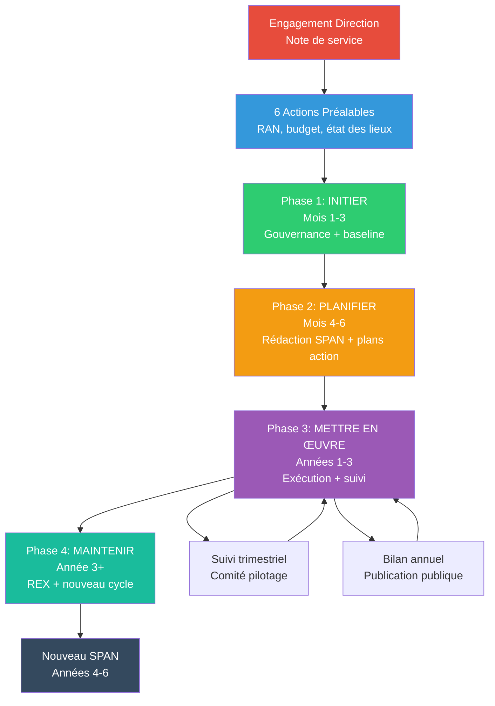
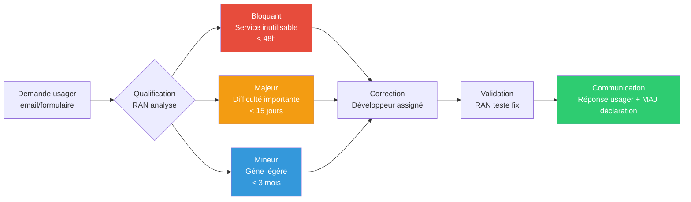
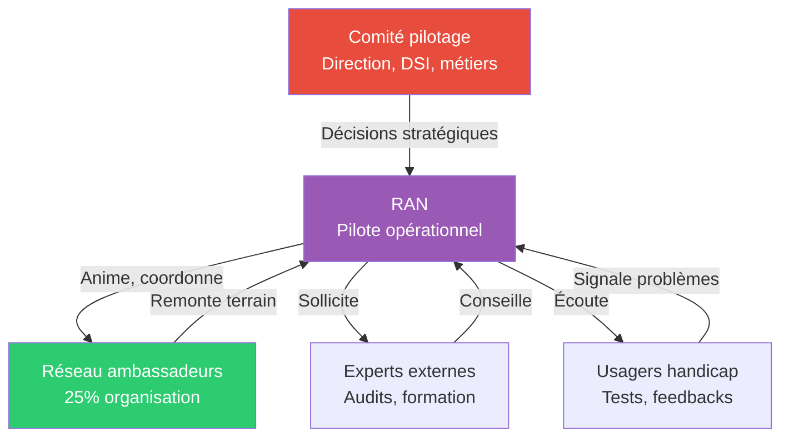

# Processus de mise en œuvre du SPAN

## Glossaire des acronymes

| Acronyme | Signification | Définition |
|----------|---------------|------------|
| **SPAN** | Schéma Pluriannuel d'Accessibilité Numérique | Document stratégique obligatoire définissant la politique d'accessibilité numérique d'une organisation sur 3 ans. |
| **RGAA** | Référentiel Général d'Amélioration de l'Accessibilité | Norme française de conformité pour l'accessibilité des services numériques publics (basée sur WCAG 2.1). |
| **RAN** | Référent·e Accessibilité Numérique | Personne officiellement désignée pour piloter la démarche d'accessibilité au sein de l'organisation. |
| **WAI** | Web Accessibility Initiative | Initiative du W3C qui développe les standards internationaux d'accessibilité web (WCAG, ARIA, etc.). |
| **WCAG** | Web Content Accessibility Guidelines | Standards internationaux d'accessibilité du contenu web (version 2.1 : 50 critères, 3 niveaux A/AA/AAA). |
| **FIPHFP** | Fonds pour l'Insertion des Personnes Handicapées dans la Fonction Publique | Organisme finançant actions d'accessibilité (jusqu'à 10K€/an pendant 3 ans). |
| **DINUM** | Direction Interministérielle du Numérique | Administration pilote de la politique d'accessibilité numérique de l'État (publie les 33 critères obligatoires). |
| **Arcom** | Autorité de régulation de la communication audiovisuelle et numérique | Contrôle la conformité accessibilité et peut sanctionner (jusqu'à 75K€/site non conforme). |
| **DITP** | Direction Interministérielle de la Transformation Publique | A émis la circulaire 6264-SG du 25/07/2019 rendant obligatoire le SPAN pour tous les ministères. |
| **DSI** | Direction des Systèmes d'Information | Service responsable des infrastructures techniques et du développement des services numériques. |
| **UX** | User Experience | Expérience utilisateur globale lors de l'utilisation d'un service numérique. |
| **ETP** | Équivalent Temps Plein | Unité de mesure du temps de travail (1 ETP = 1 personne à temps complet pendant 1 an). |
| **REX** | Retour d'Expérience | Analyse rétrospective des succès et échecs d'une démarche pour capitaliser les apprentissages. |
| **SMART** | Spécifique, Mesurable, Ambitieux, Réaliste, Temporellement défini | Critères de qualité pour définir des indicateurs efficaces. |
| **SaaS** | Software as a Service | Logiciels utilisés via abonnement cloud (ex : Google Workspace, Microsoft 365). |

---

## 1. Introduction

### Qu'est-ce que le processus SPAN ?

Le **processus de mise en œuvre du SPAN** est une démarche structurée obligatoire pour tous les ministères et administrations publiques (circulaire DITP 6264-SG du 25/07/2019). Il vise à transformer l'obligation réglementaire d'accessibilité numérique en une politique opérationnelle sur 3 ans.

### Objectifs du processus

1. **Conformité réglementaire** : 100% des services numériques conformes RGAA
2. **Inclusion effective** : Services utilisables par tous, y compris personnes en situation de handicap
3. **Transformation culturelle** : Intégrer l'accessibilité dans tous les métiers

### Cycle de vie

- **Durée** : 3 ans (publication obligatoire avant expiration)
- **Révisions** : Plans d'action annuels mis à jour en continu
- **Amélioration continue** : Bilans annuels + nouveau cycle tous les 3 ans

---

## 2. Avant de démarrer : 6 actions préalables indispensables

/// callout | Actions critiques pour le succès
    icon: alert-line
    color: orange-terre-battue
Ces 6 actions préalables conditionnent la réussite de votre SPAN. Ne pas les réaliser expose à l'échec du projet, à des sanctions financières (jusqu'à 75K€/site) et à un risque réputationnel important.
///

### 2.1 Obtenir l'engagement de la Direction
- Présenter le business case (risques juridiques : 75K€/site, bénéfices UX, image)
- Argumentaire adapté selon interlocuteur (voir [/documentation/argumentaire.md](/documentation/argumentaire.md))
- Formaliser la décision dans une note de service

**Pourquoi c'est critique** : Sans engagement Direction, pas de budget ni d'autorité pour imposer changements.

### 2.2 Identifier et nommer le/la RAN
- **Profil recherché** : compétences techniques (RGAA) + communication + gestion de projet
- **Temps alloué** : minimum 20% ETP (augmente selon taille organisation)
  - Petite structure (< 100 agents) : 20-30% ETP
  - Structure moyenne (100-500 agents) : 50-70% ETP
  - Grande structure (> 500 agents) : 100% ETP (temps plein)
- **Lettre de mission officielle** : définir périmètre, moyens, objectifs

**Pourquoi c'est critique** : Le RAN est le pilote unique. Sans personne dédiée, démarche vouée à l'échec.

### 2.3 Constituer l'écosystème d'acteurs
- **Comité de pilotage** : Direction, DSI, métiers, RH, communication, finances
- **Réseau d'ambassadeurs** : objectif = atteindre 25% de l'organisation (point de bascule culturel)
- **Partenaires externes** : experts accessibilité, auditeurs agréés, associations

**Pourquoi c'est critique** : L'accessibilité est transverse. Impossible de réussir seul·e.

### 2.4 Réaliser l'état des lieux initial
- **Inventaire exhaustif** : lister 100% des services numériques (sites web, applis mobiles, intranets, PDF)
- **Audits de conformité** : échantillon représentatif (minimum 3 services prioritaires)
- **Cartographie compétences** : qui sait quoi en accessibilité dans l'organisation ?

**Livrables** :
- Tableau Excel/LibreOffice : nom service, URL, responsable, score conformité, priorité
- Rapports d'audit RGAA complets (50 critères)

**Pourquoi c'est critique** : Impossible de piloter sans connaître le point de départ.

### 2.5 Préparer le budget pluriannuel
- **Estimation par poste** :
  - Formation : 800-1500€/personne/jour × nombre de personnes
  - Audits : 3000-8000€/audit selon complexité
  - Corrections : 5-50 jours/développeur selon dette technique
  - Outils : 500-5000€/an (licences logiciels tests)
  - Temps RAN : coût salarial × % ETP

- **Financements disponibles** :

/// callout | Financement FIPHFP disponible
    icon: money-euro-circle-line
    color: green-menthe
    link_label: En savoir plus sur le FIPHFP
    link_url: https://www.fiphfp.fr/
Le FIPHFP peut financer jusqu'à 10 000€ par an pendant 3 ans (30 000€ total) pour vos actions d'accessibilité : formations, audits RGAA, outils spécialisés.
///

  - **FIPHFP** : jusqu'à 10K€/an pendant 3 ans = 30K€ total (formations, audits)
  - Budget interne DSI/métiers
  - Mutualisation interministérielle (partage outils, formations)

- **Quantification des risques** :
  - Sanction Arcom : jusqu'à 75K€ par site non conforme
  - Risque réputationnel : médiatisation négative

**Voir guide détaillé** : [Préparer un Budget d'Accessibilité](/documentation/Préparer%20un%20Budget%20d'Accessibilité%20pour%20la%20Mise%20en%20Œuvre%20du%20SPAN.md)

**Pourquoi c'est critique** : Sans budget, impossible de former, auditer, corriger → non-conformité perpétuelle.

### 2.6 Définir les indicateurs SMART
- **Spécifiques** : liés à l'accessibilité (pas de KPI généraliste)
- **Mesurables** : chiffrés, automatisables si possible
- **Ambitieux** : objectif 100% conformité à 3 ans
- **Réalistes** : tenir compte de la dette technique actuelle
- **Temporellement définis** : jalons annuels (Année 1, 2, 3)

**Exemples d'indicateurs SMART** :
- "Atteindre 30% de services conformes RGAA à fin Année 1" (baseline actuelle : 5%)
- "Former 80% des développeurs au RGAA d'ici 18 mois" (baseline : 0%)
- "Réduire le délai moyen de traitement des demandes usagers à 10 jours à fin Année 2" (baseline : 45 jours)

**Pourquoi c'est critique** : Sans indicateurs, impossible de mesurer le progrès ni de justifier le budget.

---

## 3. Les 4 phases du processus (méthodologie WAI)

### Phase 1 : INITIER (Mois 1-3)
**Objectif** : Créer les conditions du succès

**Actions clés** :
- [ ] Validation Direction obtenue et formalisée (note de service signée)
- [ ] RAN nommé·e avec lettre de mission (périmètre, moyens, objectifs)
- [ ] Comité de pilotage constitué (première réunion organisée, calendrier annuel défini)
- [ ] État des lieux complété (inventaire 100% + minimum 3 audits RGAA)
- [ ] Budget voté (enveloppe pluriannuelle sécurisée, FIPHFP sollicité)

**Livrables** :
- Note de service Direction (engagement écrit)
- Tableau de bord initial (inventaire + scores conformité baseline)
- Plan de financement validé (sources, montants, échéancier)
- Compte-rendu 1ère réunion comité pilotage

**Pièges à éviter** :
- **Démarrer sans validation Direction** → risque d'essoufflement faute d'autorité
- **Sous-estimer le temps RAN** → burnout et abandon (minimum 20% ETP)
- **Inventaire incomplet** → angles morts critiques (intranets, PDF oubliés)
- **Budget sous-évalué** → blocage en année 2 faute de moyens

**Durée réaliste** : 2-4 mois selon taille organisation

---

### Phase 2 : PLANIFIER (Mois 4-6)
**Objectif** : Structurer la démarche sur 3 ans

**Actions clés** :
- [ ] Rédiger le SPAN (4 sections obligatoires)
- [ ] Définir les 3 plans d'action annuels (Année 1/2/3)
- [ ] Établir le calendrier de formation (publics prioritaires : développeurs, designers, chefs de projet)
- [ ] Choisir les outils (tests automatisés, gestion des demandes)
- [ ] Publier le SPAN sur le site institutionnel (page dédiée + PDF accessible)

**Structure du SPAN (4 sections obligatoires)** :

#### 1. Ambition
- Vision stratégique (pourquoi l'accessibilité est prioritaire)
- Objectifs mesurables à 3 ans (ex : 100% conformité, 80% agents formés)
- Périmètre couvert (sites web, applis mobiles, PDF, intranets)

#### 2. Organisation
- Gouvernance (comité pilotage, RAN, ambassadeurs)
- Rôles et responsabilités (qui fait quoi)
- Circuits de décision (qui valide corrections, budget, formations)

#### 3. Ressources
- Budget pluriannuel (détail par poste)
- Outils et partenaires (logiciels, prestataires audits)
- Temps alloué (ETP RAN, temps métiers)

#### 4. Gestion des compétences
- Plan de formation (publics, contenus, fréquence)
- Montée en expertise (certifications, communautés de pratique)
- Recrutement si besoin (profils accessibilité rares)

**7 domaines d'action à couvrir** :

| Domaine | Objectif | Exemples d'actions |
|---------|----------|-------------------|
| **1. Formation** | Diffuser compétences accessibilité | Sensibilisation générale (2h), formations métier (2-5 jours), certifications RGAA |
| **2. Nouveaux projets internes** | Intégrer accessibilité dès la conception | Revue accessibilité en phase design, tests RGAA avant MEP, checklist validation |
| **3. Patrimoine existant (legacy)** | Auditer et corriger services en production | Priorisation par impact usagers, plan de correction sur 3 ans, budgets dédiés |
| **4. Projets externes** | Garantir conformité prestataires | Clauses accessibilité dans cahiers des charges, recette RGAA, pénalités contractuelles |
| **5. SaaS et outils tiers** | Vérifier conformité avant achat | Grille d'évaluation accessibilité, test avant signature, clause résiliation si non-conforme |
| **6. Tests utilisateurs** | Impliquer personnes en situation de handicap | Sessions tests trimestrielles, panel usagers diversifié, rémunération testeurs |
| **7. Reporting** | Transparence et redevabilité | Publication déclarations accessibilité, bilans annuels publics, réponse demandes usagers |

**Livrables** :
- Document SPAN publié (PDF accessible WCAG 2.1 AA + page web RGAA)
- Plan d'action Année 1 détaillé (tableau actions/responsables/échéances/budget)
- Calendrier de formation semestriel (dates, publics, contenus)
- Contrats prestataires signés (audits, formation)

**Pièges à éviter** :
- **SPAN trop générique** → manque d'engagements mesurables (dire "nous voulons progresser" ≠ "atteindre 50% conformité en Année 1")
- **Plans d'action irréalistes** → démotivation équipes (ne pas promettre 100% en 6 mois si dette technique massive)
- **Oublier la publication du SPAN** → non-conformité réglementaire (obligation circulaire DITP)
- **SPAN en PDF non accessible** → incohérence symbolique fatale

**Durée réaliste** : 2-3 mois

---

### Phase 3 : METTRE EN ŒUVRE (Années 1-3)
**Objectif** : Exécuter les plans d'action et suivre l'avancement

**Rythme de travail recommandé** :

#### Trimestriellement
- [ ] **Comité de pilotage** (revue indicateurs, déblocage obstacles, ajustements budget)
- [ ] **Mise à jour tableau de bord** (conformité par direction, formations réalisées, demandes usagers traitées)
- [ ] **Communication interne** (newsletter accessibilité, succès visibles)

#### Semestriellement
- [ ] **Sessions de formation** (2 vagues/an minimum : sensibilisation + formations métier)
- [ ] **Audits de conformité** (nouveaux sites lancés + réévaluations sites corrigés)
- [ ] **Tests utilisateurs** (panel personnes en situation de handicap)

#### Annuellement
- [ ] **Bilan annuel publié** (voir guide [Réaliser le bilan des plans d'actions](/documentation/Réaliser%20le%20bilan%20des%20plans%20d'actions%20annuels%20et%20piloter%20la%20mise%20à%20jour%20du%20SPAN.md))
- [ ] **Mise à jour plan d'action année N+1** (ajustements selon résultats)
- [ ] **Révision budget si nécessaire** (réallouer si sous/sur-consommation)
- [ ] **Publication déclarations d'accessibilité** (100% services = obligation légale)

**Outils de suivi** :
- **Tableau de bord Excel/LibreOffice** : inventaire services, scores, actions, statuts
- **Outil de ticketing** : gestion demandes usagers (Jira, GitLab Issues, Mantis, etc.)
- **Calendrier partagé** : formations, audits, comités pilotage (Google Calendar, Outlook)
- **Wiki interne** : documentation bonnes pratiques, guides, REX

**Gestion des demandes usagers** :
```
Entrée → Qualification → Priorisation → Traitement → Validation → Communication
(email,    (RAN analyse  (grille       (dev corrige) (RAN teste)  (réponse usager
formulaire) bloquant?)    criticité)                               + publication)
```

**Critères de priorisation** :

| Criticité | Définition | Exemple | Délai |
|-----------|-----------|---------|-------|
| **Bloquant** | Impossible d'utiliser le service | Formulaire inaccessible au clavier, images sans alt sur contenu essentiel | < 48h |
| **Majeur** | Difficulté importante mais contournable | Navigation complexe, contrastes insuffisants, PDF non tagué | < 15 jours |
| **Mineur** | Gêne légère | Libellés imprécis, ordre de tabulation sous-optimal | < 3 mois |

**Pièges à éviter** :
- **Perte de dynamique après 6 mois** → prévoir événements fédérateurs (Journée accessibilité, awards internes)
- **Accumulation de dette technique** → corriger au fil de l'eau (ne pas repousser à Année 3)
- **Communication insuffisante** → rendre les progrès visibles (newsletter, dashboard public)
- **Turnover non anticipé** → documenter en continu pour assurer passation

**Durée** : 3 ans (cycle complet SPAN)

---

### Phase 4 : MAINTENIR (Année 3 et au-delà)
**Objectif** : Pérenniser la démarche et préparer le prochain cycle

**Année 3 - Actions spécifiques** :
- [ ] **Bilan complet 3 ans** (atteinte objectifs SPAN : conformité, formation, budget consommé)
- [ ] **Retour d'expérience (REX)** :
  - Ce qui a marché (capitaliser bonnes pratiques)
  - Ce qui a échoué (analyser causes, éviter répétition)
  - Leçons apprises (pour nouveau cycle)
- [ ] **Rédaction nouveau SPAN** pour années 4-6 (objectifs plus ambitieux basés sur maturité acquise)
- [ ] **Publication nouveau SPAN** avant échéance (obligation réglementaire : pas de vide entre 2 SPAN)

**Amélioration continue** :
- **Capitaliser bonnes pratiques** : créer bibliothèque de composants accessibles (design system)
- **Former nouveaux arrivants** : module accessibilité dans onboarding
- **Faire évoluer processus métier** : intégration native (accessibilité = critère qualité standard)
- **Automatiser tests** : intégrer tests accessibilité dans CI/CD (pipeline DevOps)

**Gestion du turnover** :
- **Documentation à jour** : wiki interne, guides, procédures (pas de connaissance dans la tête du RAN uniquement)
- **Passation formalisée** si changement RAN :
  - Période de tuilage 3-6 mois
  - Transmission tableau de bord, contacts, dossiers en cours
  - Présentation nouveau RAN au comité pilotage et réseau ambassadeurs
- **Continuité assurée par réseau ambassadeurs** : si RAN part, ambassadeurs maintiennent dynamique

**Pièges à éviter** :
- **Relâchement après atteinte objectifs** → risque de régresser (accessibilité = démarche continue)
- **Départ RAN sans passation** → perte de mémoire institutionnelle (tout à reconstruire)
- **Nouveau SPAN copié-collé** → ne pas capitaliser sur expérience (objectifs identiques = stagnation)
- **Fin de budget après 3 ans** → prévoir budget pérenne dans fonctionnement normal

**Indicateur de maturité** : L'accessibilité est maintenue quand elle devient invisible (intégrée dans tous les processus métier, plus besoin de RAN à temps plein).

---

## 4. Acteurs et gouvernance

### Référent·e Accessibilité Numérique (RAN)
**Mission** : Pilote la démarche au quotidien

**Responsabilités** :
- Anime le comité de pilotage (préparation réunions, CR, suivi décisions)
- Coordonne audits et formations (planification, suivi prestataires, contrôle qualité)
- Assure le suivi des indicateurs (tableau de bord, reporting Direction)
- Point de contact usagers et Direction (réponse demandes, remontées terrain)
- Veille réglementaire et technique (évolutions RGAA, jurisprudence, outils)

**Compétences requises** :
- Techniques : maîtrise RGAA (idéalement certification), HTML/CSS/ARIA, outils de test
- Transverses : gestion de projet, pédagogie, communication, négociation
- Relationnelles : diplomatie (faire bouger lignes sans autorité hiérarchique)

**Temps nécessaire** : voir § 2.2 (20% à 100% ETP selon taille)

---

### Comité de pilotage SPAN
**Mission** : Décisions stratégiques et déblocage

**Composition** :
- Direction générale (sponsor exécutif)
- DSI (responsable technique)
- Métiers (responsables de services numériques)
- RH (gestion compétences, recrutement)
- Communication (publication, sensibilisation)
- Finances (budget, arbitrages)
- RAN (pilote, secrétariat)

**Fréquence** : Trimestrielle (4 réunions/an minimum)

**Ordre du jour type** :
1. Revue indicateurs (conformité, formation, budget)
2. Points de blocage (déblocage décisions, arbitrages)
3. Décisions à prendre (validation audits, lancement formations, budget supplémentaire)
4. Communication (interne/externe)
5. Prochaines échéances

**Livrables** : Compte-rendu + tableau de décisions/actions

---

### Réseau d'ambassadeurs
**Mission** : Relais terrain et sensibilisation

**Composition** :
- Développeurs volontaires (front-end prioritaires)
- Designers/UX (conception accessible)
- Chefs de projet (intégration accessibilité dans roadmaps)
- Rédacteurs web (contenus accessibles)
- Acheteurs (clauses marchés publics)

**Objectif quantitatif** : Atteindre 25% de l'organisation (point de bascule culturel - voir [Facteurs-clés de succès](/documentation/Facteurs-clés%20de%20succès.md))

**Animation** :
- Réunions mensuelles (partage bonnes pratiques, REX)
- Messagerie/Slack dédiée (entraide quotidienne)
- Formation continue (ambassadeurs = experts référents)

**Reconnaissance** :
- Valorisation dans entretiens annuels
- Certificats de compétences
- Visibilité interne (newsletter, événements)

---

### Parties prenantes externes

**Usagers en situation de handicap** :
- Tests utilisateurs (rémunérés)
- Feedbacks sur accessibilité réelle (au-delà conformité technique)
- Co-conception de services

**Experts accessibilité** :
- Audits de conformité RGAA
- Conseil stratégique
- Formation

**Ministères pairs** :
- Partage d'expérience (REX, outils mutualisés)
- Communauté de pratique interministérielle
- Mutualisation achats (formations, audits groupés)

**Associations** :
- Relais vers communautés (sourds, aveugles, handicap cognitif)
- Sensibilisation agents
- Tests usagers

---

## 5. Indicateurs de suivi

### Indicateurs de conformité (résultat)

| Indicateur | Formule | Objectif 3 ans | Fréquence mesure |
|-----------|---------|----------------|------------------|
| **% services conformes RGAA** | (Nb services 100% conformes / Total services) × 100 | 100% | Trimestrielle |
| **% services avec déclaration accessibilité** | (Nb déclarations publiées / Total services) × 100 | 100% | Mensuelle |
| **Score moyen de conformité** | Moyenne scores RGAA tous services (0-100%) | > 95% | Trimestrielle |
| **Nb de non-conformités critiques** | Critères RGAA niveau A non respectés | 0 | Trimestrielle |

**Source données** : Audits RGAA (manuels + automatisés)

---

### Indicateurs de capacité (moyens)

| Indicateur | Formule | Objectif 3 ans | Fréquence mesure |
|-----------|---------|----------------|------------------|
| **Nombre de personnes formées** | Total agents formés (sensibilisation + métier) | 80% profils cibles | Semestrielle |
| **Nombre d'audits réalisés/an** | Total audits RGAA complets | Couvrir 100% patrimoine | Annuelle |
| **Temps moyen traitement demandes usagers** | Moyenne délai réception → réponse (jours) | < 10 jours | Mensuelle |
| **Budget consommé vs prévu** | (Budget dépensé / Budget voté) × 100 | 100% (ni sous ni sur) | Trimestrielle |

**Source données** : Tableau de bord RAN, outil ticketing, compta

---

### Indicateurs d'impact (bénéfices)

| Indicateur | Formule | Objectif | Fréquence mesure |
|-----------|---------|----------|------------------|
| **Nombre demandes usagers accessibilité** | Total demandes reçues/mois | Baisse (services plus accessibles) | Mensuelle |
| **Satisfaction usagers** | Enquête annuelle (note /10) | > 8/10 | Annuelle |
| **Taux de récidive anomalies** | (Anomalies réapparues / Total corrections) × 100 | < 10% | Trimestrielle |
| **Délai moyen de correction** | Moyenne jours entre détection → correction | < 15 jours | Mensuelle |

**Source données** : Enquêtes, ticketing, audits de contrôle

---

### Dashboard de pilotage (exemple)

```
┌─────────────────────────────────────────────────┐
│ SPAN - Tableau de bord Trimestre 3 Année 2     │
├─────────────────────────────────────────────────┤
│ CONFORMITÉ                                       │
│ [OK] Services conformes      : 45/60 (75%)  +15%│
│ [OK] Déclarations publiées   : 60/60 (100%) OK  │
│ [!]  Score moyen conformité : 88%          +8%  │
├─────────────────────────────────────────────────┤
│ CAPACITÉ                                         │
│ [OK] Personnes formées       : 120/150 (80%) OK │
│ [OK] Audits réalisés (total) : 55/60 (92%)  +10 │
│ [!]  Délai moyen demandes   : 12 jours     -3j  │
├─────────────────────────────────────────────────┤
│ IMPACT                                           │
│ [OK] Demandes usagers/mois   : 8            -40%│
│ [OK] Satisfaction            : 8.2/10       +0.5 │
│ [OK] Taux récidive           : 5%           -8%  │
├─────────────────────────────────────────────────┤
│ PROCHAINES ACTIONS                               │
│ • Formation designers (15 nov)                   │
│ • Audit site X (30 nov)                          │
│ • Comité pilotage (5 déc)                        │
└─────────────────────────────────────────────────┘
```

---

## 6. Ressources et outils

### Guides détaillés disponibles (dans `/documentation`)
- [Préparer un Budget d'Accessibilité](/documentation/Préparer%20un%20Budget%20d'Accessibilité%20pour%20la%20Mise%20en%20Œuvre%20du%20SPAN.md) - Méthodologie complète budgétisation
- [Réaliser le bilan des plans d'actions](/documentation/Réaliser%20le%20bilan%20des%20plans%20d'actions%20annuels%20et%20piloter%20la%20mise%20à%20jour%20du%20SPAN.md) - Processus revue annuelle
- [Facteurs-clés de succès](/documentation/Facteurs-clés%20de%20succès.md) - Théorie du tipping point, stratégies convaincre
- [Argumentaire pour convaincre](/documentation/argumentaire.md) - Arguments/contre-arguments par profil décideur
- [Les attendus du SPAN](/documentation/les-attendus-du-span.md) - Cours complet formation RAN

### Templates fournis
- Tableau de suivi des actions (Excel/LibreOffice)
- Trame de déclaration d'accessibilité (HTML + markdown)
- Modèle de rapport d'audit RGAA
- Checklist 33 critères DINUM/Arcom

### Outils techniques recommandés

**Tests automatisés** (environ 30% des critères RGAA) :
- [Axe DevTools](https://www.deque.com/axe/devtools/) - Extension navigateur gratuite
- [WAVE](https://wave.webaim.org/) - Analyse en ligne gratuite
- [Pa11y](https://pa11y.org/) - CLI pour tests automatisés CI/CD

**Tests manuels** (70% des critères RGAA) :
- **Lecteurs d'écran** : NVDA (gratuit Windows), JAWS (payant), VoiceOver (macOS/iOS natif)
- **Extensions navigateur** : HeadingsMap, Colour Contrast Analyser, Accessibility Insights
- **Outils clavier** : tests navigation sans souris (Tab, Shift+Tab, Entrée, Échap)

**Gestion de projet** :
- Jira, GitLab Issues, Trello, Asana (suivi actions, demandes usagers)
- Confluence, Wiki.js (documentation interne)

**Design accessible** :
- Figma plugins : Stark (contrastes), A11y Annotation Kit
- Design systems publics : DSFR (design.numerique.gouv.fr), RGAA (accessibilite.numerique.gouv.fr)

### Formations recommandées
- **Sensibilisation (2h)** : Tout agent (comprendre enjeux, bases)
- **RGAA niveau 1 (2 jours)** : Développeurs, designers (critères, tests)
- **RGAA niveau 2 (3 jours)** : Développeurs confirmés (correction bugs complexes)
- **Certification RGAA (5 jours)** : RAN, experts (auditer, former)

**Organismes** : Access42, Atalan, Koena, Temesis

### Communautés et veille
- **Newsletter** : Access42, Atalan, AcceDeWeb
- **Événements** : Paris Web, JNAA (Journée Nationale Accessibilité)
- **Slack/Discord** : Communauté francophone accessibilité numérique
- **W3C-WAI** : Standards internationaux (WCAG, ARIA)

---

## 7. Diagrammes de synthèse

### Diagramme 1 : Vue d'ensemble du processus SPAN



### Diagramme 2 : Gestion des demandes usagers



### Diagramme 3 : Écosystème d'acteurs



---

## 8. Pour démarrer rapidement

### Checklist RAN nouveau/nouvelle (Semaine 1)

#### Jour 1-2 : S'approprier le sujet
- [ ] Lire le guide complet [Les attendus du SPAN](/documentation/les-attendus-du-span.md) (524 lignes, 2h lecture)
- [ ] Consulter [l'argumentaire](/documentation/argumentaire.md) pour préparer présentation Direction
- [ ] Parcourir 3 exemples de SPAN publiés (ministères pairs) pour inspiration
- [ ] Tester un lecteur d'écran (NVDA Windows ou VoiceOver Mac) sur 2-3 sites gouvernementaux

#### Jour 3 : Cartographier l'existant
- [ ] Lister tous les services numériques de l'organisation (tableau Excel : nom, URL, responsable)
- [ ] Identifier 3 services prioritaires pour audits initiaux (fort trafic + criticité)
- [ ] Recenser compétences accessibilité en interne (qui sait quoi ?)

#### Jour 4 : Préparer le business case
- [ ] Utiliser template budget ([guide dédié](/documentation/Préparer%20un%20Budget%20d'Accessibilité%20pour%20la%20Mise%20en%20Œuvre%20du%20SPAN.md))
- [ ] Estimer enveloppe minimale (30K€ FIPHFP + budget interne)
- [ ] Quantifier risques (75K€ × nb sites non conformes)

#### Jour 5 : Prendre RDV Direction
- [ ] Préparer présentation 15 min (obligation légale + risques + opportunités)
- [ ] Demander validation principe + nomination officielle RAN
- [ ] Proposer 1ère réunion comité pilotage (semaine suivante)

### Checklist Mois 1 (consolidation)
- [ ] Obtenir lettre de mission RAN signée (périmètre, moyens, temps alloué)
- [ ] Constituer comité pilotage (1ère réunion organisée)
- [ ] Lancer 3 audits RGAA initiaux (prestataire ou interne si compétences)
- [ ] Compléter inventaire exhaustif services (100%)
- [ ] Identifier 5-10 ambassadeurs potentiels (volontaires motivés)

### Checklist Mois 2-3 (planification)
- [ ] Synthétiser résultats audits (baseline conformité)
- [ ] Préparer budget détaillé 3 ans (validation finances)
- [ ] Rédiger version 1 du SPAN (4 sections obligatoires)
- [ ] Définir 10-15 indicateurs SMART (conformité + capacité + impact)
- [ ] Planifier formations Année 1 (sensibilisation + RGAA développeurs)

### Checklist Mois 4-6 (lancement)
- [ ] Publier SPAN sur site institutionnel (PDF accessible + page web)
- [ ] Communiquer en interne (lancement officiel, newsletter)
- [ ] Lancer 1ère vague formations (sensibilisation générale)
- [ ] Mettre en place tableau de bord (suivi mensuel)
- [ ] Organiser 2ème comité pilotage (revue progrès, ajustements)

---

## 9. Questions fréquentes (FAQ)

### Qui peut être RAN ?
Profil idéal : développeur web ou designer avec appétence communication. Pas besoin d'être expert RGAA au départ (formation possible), mais nécessite rigueur technique + capacité à convaincre.

### Combien coûte un SPAN sur 3 ans ?
Variable selon taille organisation :
- Petite structure (5-10 sites) : 50-100K€
- Structure moyenne (10-30 sites) : 150-300K€
- Grande structure (30+ sites) : 500K€-1M€
Financement FIPHFP : jusqu'à 30K€ (10K€/an × 3 ans).

### Combien de temps pour atteindre 100% conformité ?
Dépend de la dette technique actuelle :
- Sites récents bien codés : 6-12 mois
- Sites legacy complexes : 2-3 ans
- Objectif réaliste SPAN : 80% conformité à 2 ans, 100% à 3 ans.

### Que se passe-t-il si on ne publie pas de SPAN ?
- Non-conformité à la circulaire DITP 6264-SG
- Risque de signalement Arcom (contrôle pouvant mener à sanctions 75K€/site)
- Risque réputationnel (médiatisation, associations)

### Peut-on sous-traiter tout à un prestataire ?
Non. Le RAN doit être interne (pilotage stratégique). On peut sous-traiter :
- Audits de conformité (experts externes)
- Formations (organismes certifiés)
- Corrections techniques (si pas de compétences internes)
Mais gouvernance, suivi, décisions = responsabilité interne.

### Comment gérer la résistance au changement ?
- **Convaincre par l'empathie** : démonstrations lecteur d'écran, témoignages usagers
- **Convaincre par la raison** : business case (risques juridiques, ROI)
- **Stratégie minorité engagée** : viser 25% d'ambassadeurs pour faire basculer culture (voir [Facteurs-clés de succès](/documentation/Facteurs-clés%20de%20succès.md))

### Quelle différence entre SPAN et déclaration d'accessibilité ?
- **SPAN** : document stratégique 3 ans (politique générale de l'organisation)
- **Déclaration d'accessibilité** : document par direction numérique (état conformité spécifique)
Les deux sont obligatoires et complémentaires.

---

## 10. Conclusion

### Synthèse des points-clés

1. **Le SPAN n'est pas un document administratif** : c'est un outil de transformation organisationnelle sur 3 ans.

2. **La réussite repose sur 3 piliers** :
   - Engagement Direction (sans quoi rien n'est possible)
   - RAN avec moyens suffisants (temps + budget)
   - Réseau d'ambassadeurs (25% pour faire basculer culture)

3. **L'accessibilité n'est pas un projet ponctuel** : c'est un processus continu intégré dans tous les métiers.

4. **La conformité technique (RGAA) est un moyen, pas une fin** : l'objectif final = services utilisables par tous.

5. **L'amélioration continue prime sur la perfection immédiate** : progresser de 10%/an pendant 3 ans vaut mieux que viser 100% en 6 mois et échouer.

### Prochaines étapes

Si vous débutez la démarche SPAN :
1. **Semaine 1** : Lire les guides, préparer business case, prendre RDV Direction
2. **Mois 1-3** : Phase INITIER (gouvernance + état des lieux)
3. **Mois 4-6** : Phase PLANIFIER (rédaction SPAN + plans action)
4. **Années 1-3** : Phase METTRE EN ŒUVRE (exécution + suivi)
5. **Année 3+** : Phase MAINTENIR (REX + nouveau cycle)

### Ressources de support

- **Questions** : Poser dans communautés (Slack accessibilité francophone)
- **Difficultés** : Solliciter ministères pairs (partage d'expérience)
- **Expertise** : Faire appel à organismes spécialisés (Access42, Atalan, Koena)

**Le processus SPAN peut sembler complexe, mais chaque organisation l'a parcouru. Vous n'êtes pas seul·e.**
